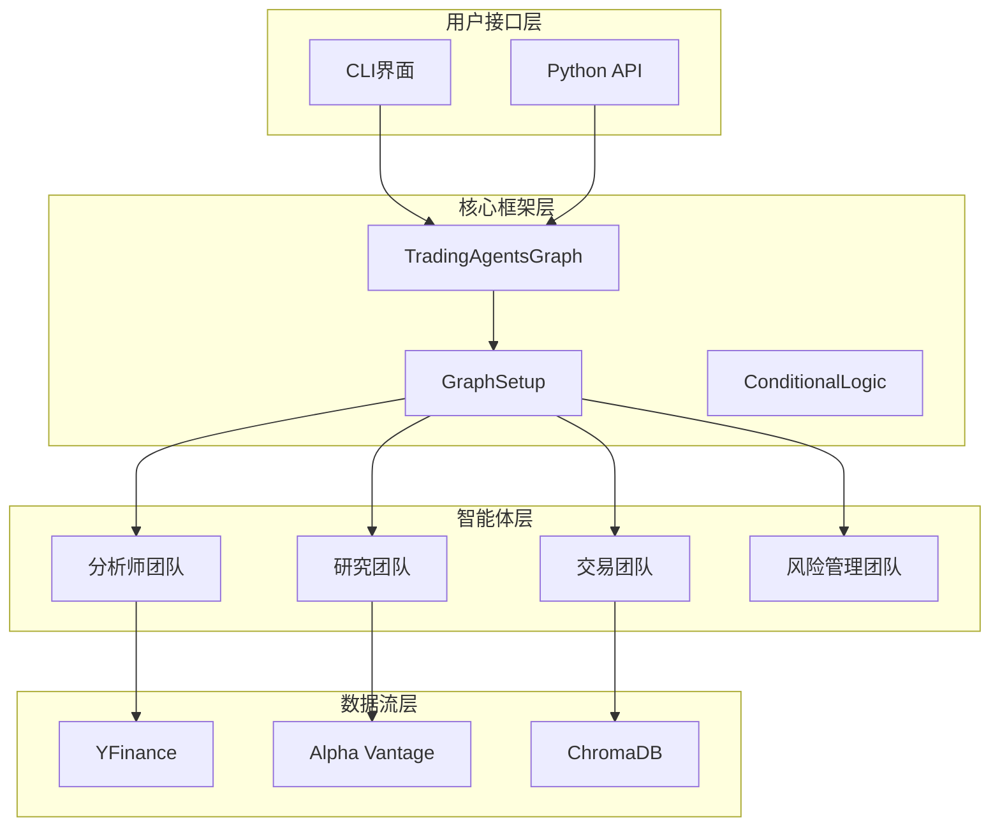
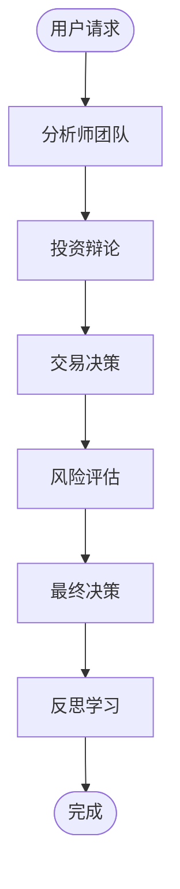

# TradingAgents 完整技术文档目录

## 📚 文档概览

本文档集合提供了TradingAgents多智能体金融交易框架的完整技术文档，涵盖架构设计、用户指南、部署运维和系统流程等各个方面。

## 📋 文档列表

### 1. 📐 [架构设计文档](./architecture-design.md)
- **系统概述**：整体架构和核心组件介绍
- **智能体架构**：分析师团队、研究团队、交易团队、风险管理团队的详细设计
- **数据流架构**：数据路由、缓存策略、供应商配置
- **工作流状态机**：智能体协作和决策流程
- **扩展性设计**：新智能体、数据源、LLM提供商的扩展方案
- **安全性和性能优化**：系统安全和性能保障机制

### 2. 👥 [用户手册](./user-manual.md)
- **快速开始**：安装、配置、验证步骤
- **CLI界面使用**：交互式配置向导和实时监控界面
- **Python API使用**：基础和高级编程接口
- **配置详解**：完整的配置选项和最佳实践
- **输出解读**：分析报告结构和决策信号处理
- **故障排除**：常见问题和调试技巧

### 3. 🚀 [部署手册](./deployment-manual.md)
- **系统要求**：最低、推荐和生产环境配置
- **本地部署**：开发环境和Docker容器化部署
- **云端部署**：AWS、GCP、Azure云平台部署方案
- **生产环境配置**：负载均衡、数据库、监控配置
- **安全配置**：API密钥管理、网络安全、SSL/TLS配置
- **备份和恢复**：数据备份策略和灾难恢复方案

### 4. 🔧 [运维手册](./operations-manual.md)
- **监控体系**：应用、基础设施、业务指标监控
- **日志管理**：日志架构、配置和分析脚本
- **故障处理**：故障分类、处理流程和自动恢复
- **性能优化**：应用层、数据库、资源优化策略
- **安全运维**：安全监控、访问控制、数据备份
- **运维自动化**：CI/CD、监控告警、日常检查清单

### 5. 🔄 [流程设计图](./process-flow-diagrams.md)
- **整体系统流程**：系统架构和数据流程图
- **智能体协作流程**：分析师团队、投资辩论、风险管理流程
- **数据处理流程**：数据获取、缓存策略、机器学习流程
- **系统运维流程**：部署、监控告警、故障处理、安全流程
- **性能优化流程**：性能监控和自动扩缩容流程
- **数据治理流程**：数据质量管理和生命周期管理

## 🎯 文档使用指南

### 🏗️ 架构师/开发者
1. 首先阅读 **[架构设计文档](./architecture-design.md)** 了解系统整体架构
2. 查看 **[流程设计图](./process-flow-diagrams.md)** 理解系统工作流程
3. 参考 **[用户手册](./user-manual.md)** 了解API使用方法
4. 根据 **[部署手册](./deployment-manual.md)** 进行环境搭建

### 🔧 运维工程师
1. 从 **[部署手册](./deployment-manual.md)** 开始了解部署方案
2. 详细阅读 **[运维手册](./operations-manual.md)** 掌握运维技能
3. 参考 **[流程设计图](./process-flow-diagrams.md)** 理解系统流程
4. 使用 **[用户手册](./user-manual.md)** 了解系统功能

### 👨‍💼 系统管理员
1. 重点阅读 **[部署手册](./deployment-manual.md)** 的生产环境配置
2. 关注 **[运维手册](./operations-manual.md)** 的安全和备份章节
3. 了解 **[架构设计文档](./architecture-design.md)** 的安全性设计
4. 掌握 **[流程设计图](./process-flow-diagrams.md)** 的故障处理流程

### 📊 数据分析师
1. 阅读 **[用户手册](./user-manual.md)** 了解如何使用系统
2. 查看 **[架构设计文档](./architecture-design.md)** 的数据处理架构
3. 参考 **[流程设计图](./process-flow-diagrams.md)** 的数据治理流程

## 🏗️ 系统架构概览



## 🔄 核心工作流程



## 🛠️ 技术栈

### 核心技术
- **Python 3.10+**：主要开发语言
- **LangChain/LangGraph**：LLM应用框架
- **ChromaDB**：向量数据库
- **Redis**：缓存服务
- **Docker**：容器化部署

### LLM提供商
- **OpenAI**：GPT系列模型
- **Anthropic**：Claude系列模型
- **Google**：Gemini系列模型
- **Ollama**：本地模型支持

### 数据源
- **YFinance**：股票价格和技术数据
- **Alpha Vantage**：基本面和新闻数据
- **Google News**：新闻数据
- **本地数据**：缓存和离线数据

### 部署平台
- **本地环境**：开发和小规模部署
- **AWS**：ECS、EKS、Lambda
- **Google Cloud**：Cloud Run、GKE
- **Azure**：Container Instances
- **Kubernetes**：企业级容器编排

## 📊 性能指标

### 系统性能
- **响应时间**：< 5秒（95分位）
- **吞吐量**：100 RPM/实例
- **可用性**：99.9%
- **错误率**：< 5%

### 智能体性能
- **执行时间**：< 300秒/智能体
- **成功率**：> 95%
- **决策准确率**：> 70%
- **数据新鲜度**：< 5分钟

## 🔒 安全特性

### 数据安全
- API密钥加密存储
- 数据传输TLS加密
- 敏感数据脱敏
- 访问权限控制

### 系统安全
- 容器安全扫描
- 网络隔离
- 入侵检测
- 安全审计

## 📈 监控和告警

### 监控指标
- **应用监控**：响应时间、错误率、吞吐量
- **系统监控**：CPU、内存、磁盘、网络
- **业务监控**：决策质量、API调用、成本控制

### 告警机制
- **邮件告警**：关键故障通知
- **Slack通知**：实时状态更新
- **短信告警**：紧急故障通知
- **自动恢复**：常见故障自动处理

## 🚀 快速开始

### 1. 环境准备
```bash
# 克隆项目
git clone https://github.com/TauricResearch/TradingAgents.git
cd TradingAgents

# 创建虚拟环境
python -m venv venv
source venv/bin/activate

# 安装依赖
pip install -r requirements.txt
```

### 2. 配置API密钥
```bash
# 复制配置文件
cp .env.example .env

# 编辑配置文件
nano .env
```

### 3. 运行系统
```bash
# 启动CLI
python -m cli.main

# 或运行示例
python main.py
```

## 🤝 贡献指南

### 开发流程
1. Fork项目到个人仓库
2. 创建功能分支
3. 提交代码变更
4. 创建Pull Request
5. 代码审查和合并

### 文档贡献
- 发现文档错误请提交Issue
- 建议改进请提交Pull Request
- 新功能请同步更新文档

## 📞 支持和联系

### 技术支持
- **GitHub Issues**：https://github.com/TauricResearch/TradingAgents/issues
- **Discord社区**：https://discord.com/invite/hk9PGKShPK
- **官方网站**：https://tauric.ai/

### 商业支持
- **企业版**：提供商业支持和技术服务
- **定制开发**：根据需求定制功能
- **咨询服务**：架构设计和最佳实践咨询

---

## 📄 许可证

本项目采用MIT许可证，详见[LICENSE](../LICENSE)文件。

## 🙏 致谢

感谢所有贡献者和社区成员的支持，特别是：
- **Tauric Research**团队的核心开发
- **LangChain**和**LangGraph**社区的技术支持
- **Alpha Vantage**提供的数据服务支持
- 所有测试用户和反馈者

---

*最后更新：2024年12月*