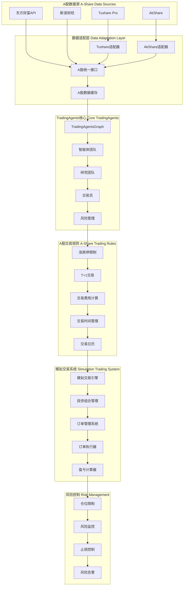

# TradingAgents A股接入与模拟炒股完整方案

## 📋 项目概述

基于对TradingAgents项目的深入分析，我已经设计了一套完整的A股接入和模拟炒股方案。该方案包括数据源适配、交易规则实现、模拟交易系统、智能体适配等所有关键组件。

---

## 🎯 核心目标

### 主要功能
1. **A股数据接入** - 集成Tushare、AkShare等数据源
2. **交易规则适配** - 实现A股特有的交易规则（T+1、涨跌停、交易费用）
3. **模拟交易系统** - 构建完整的A股模拟交易平台
4. **智能分析增强** - 适配智能体分析A股市场特点
5. **风险控制** - 实现符合A股特点的风险管理

### 技术特色
- **多数据源支持** - Tushare Pro、AkShare等主流数据源
- **完整规则实现** - 涨跌停、T+1、交易费用、最小交易单位
- **实时行情** - 支持实时行情获取和技术指标计算
- **智能分析** - 针对A股特点优化的智能体分析
- **风险管控** - 多层次风险控制和仓位管理

---

## 🏗️ 系统架构设计

### 整体架构图



---

## 📊 数据源适配方案

### 1. 主要数据源

#### Tushare Pro（推荐）
- **优势**：数据质量高、覆盖全面、官方API
- **数据类型**：历史行情、财务数据、实时行情（高级权限）
- **适用场景**：生产环境、对数据质量要求高的场景

#### AkShare（备选）
- **优势**：免费开源、数据源丰富、社区活跃
- **数据类型**：历史行情、实时行情、新闻数据
- **适用场景**：开发测试、成本敏感的场景

### 2. 数据适配器设计

```python
# 统一数据接口设计
class AShareDataInterface:
    def __init__(self, config):
        self.primary_source = config.get('primary_source', 'tushare')
        self.fallback_source = config.get('fallback_source', 'akshare')
        self.cache = {}
        self.cache_ttl = config.get('cache_ttl', 300)
    
    def get_stock_data(self, symbol, start_date, end_date):
        # 主数据源 -> 备用数据源 -> 缓存机制
        pass
    
    def get_technical_indicators(self, symbol, indicators, current_date):
        # 技术指标计算（RSI、MACD、布林带等）
        pass
    
    def get_realtime_quote(self, symbol):
        # 实时行情获取
        pass
```

### 3. 数据质量保障

- **多源验证** - 交叉验证不同数据源的一致性
- **缓存机制** - 减少API调用，提高响应速度
- **异常处理** - 完善的错误处理和重试机制
- **数据清洗** - 自动处理异常数据和缺失值

---

## 🏛️ A股交易规则实现

### 1. 核心交易规则

#### 涨跌停限制
```python
# 不同板块涨跌幅限制
PRICE_LIMITS = {
    'normal': 0.10,    # 普通股票 ±10%
    'st': 0.05,        # ST股票 ±5%
    'gem': 0.20,       # 创业板 ±20%
    'star': 0.20,      # 科创板 ±20%
    'bse': 0.30,       # 北交所 ±30%
}
```

#### T+1交易制度
```python
def check_t_plus1(buy_date, sell_date):
    # 买入后下一个交易日才能卖出
    next_trading_day = get_next_trading_day(buy_date)
    return sell_date >= next_trading_day
```

#### 交易费用计算
```python
def calculate_trading_fees(symbol, price, quantity, side):
    amount = price * quantity
    
    # 佣金（双向收取）
    commission = max(amount * 0.00025, 5)  # 万分之2.5，最低5元
    
    # 印花税（仅卖出收取）
    stamp_tax = amount * 0.001 if side == 'sell' else 0  # 千分之一
    
    # 过户费（仅沪市收取）
    transfer_fee = amount * 0.00002 if is_sh_stock(symbol) else 0  # 万分之0.2
    
    return {
        'commission': commission,
        'stamp_tax': stamp_tax,
        'transfer_fee': transfer_fee,
        'total_fees': commission + stamp_tax + transfer_fee
    }
```

### 2. 交易时间管理

```python
class TradingCalendar:
    def is_trading_day(self, date):
        # 检查是否为交易日（排除周末和节假日）
        pass
    
    def is_trading_time(self, current_time):
        # 检查是否在交易时间内（9:30-11:30, 13:00-15:00）
        pass
    
    def get_next_trading_day(self, date):
        # 获取下一个交易日
        pass
```

---

## 🎮 模拟交易系统设计

### 1. 核心交易引擎

```python
class AShareSimulator:
    def __init__(self, initial_capital=1000000):
        self.initial_capital = initial_capital
        self.current_capital = initial_capital
        self.positions = {}      # 持仓信息
        self.orders = []         # 订单历史
        self.trades = []         # 成交记录
        self.daily_pnl = []      # 每日盈亏
        
        # 初始化交易规则和数据接口
        self.trading_rules = AShareTradingRules()
        self.data_adapter = AShareDataInterface()
    
    def place_order(self, symbol, side, quantity, order_type='market'):
        # 下单流程：
        # 1. 获取实时价格
        # 2. 验证订单有效性（交易时间、涨跌停、最小单位）
        # 3. 风险检查（仓位限制）
        # 4. 计算交易费用
        # 5. 执行订单
        # 6. 更新持仓和资金
        # 7. 记录交易
        pass
    
    def get_portfolio_value(self):
        # 计算投资组合价值：
        # 1. 获取各股票当前价格
        # 2. 计算持仓市值
        # 3. 计算未实现盈亏
        # 4. 计算总资产和收益率
        pass
```

### 2. 投资组合管理

```python
class PortfolioManager:
    def rebalance_portfolio(self, target_weights):
        # 投资组合再平衡：
        # 1. 计算当前持仓权重
        # 2. 计算目标持仓
        # 3. 生成调仓订单
        # 4. 执行再平衡
        pass
    
    def calculate_performance_metrics(self):
        # 绩效指标计算：
        # 1. 总收益率
        # 2. 夏普比率
        # 3. 最大回撤
        # 4. 胜率统计
        # 5. 风险价值（VaR）
        pass
```

### 3. 风险控制系统

```python
class RiskManager:
    def check_position_limits(self, symbol, quantity, price):
        # 仓位限制检查：
        # 1. 单股最大仓位（如10%）
        # 2. 总仓位限制（如95%）
        # 3. 行业集中度限制
        pass
    
    def monitor_risk_metrics(self):
        # 风险指标监控：
        # 1. 投资组合波动率
        # 2. VaR计算
        # 3. 相关性分析
        # 4. 流动性风险
        pass
```

---

## 🤖 智能体A股适配

### 1. A股市场分析师

```python
def create_a_share_market_analyst(llm):
    def a_share_market_analyst_node(state):
        # A股特有分析重点：
        # 1. 技术指标分析（适配A股特点）
        # 2. 价格行为分析（涨跌停影响）
        # 3. 成交量分析（A股成交量重要性）
        # 4. 板块轮动分析（A股特有现象）
        # 5. 政策影响分析（A股政策敏感性）
        pass
```

### 2. A股新闻分析师

```python
def create_a_share_news_analyst(llm):
    def a_share_news_analyst_node(state):
        # A股新闻分析重点：
        # 1. 政策新闻解读
        # 2. 公司公告分析
        # 3. 行业动态跟踪
        # 4. 市场情绪分析
        # 5. 监管政策影响
        pass
```

### 3. 智能体协作优化

```python
# 针对A股特点的智能体协作流程
def create_a_share_workflow():
    # 1. 分析师团队：A股市场分析 + A股新闻分析
    # 2. 研究团队：考虑A股特点的投资辩论
    # 3. 交易员：A股交易策略制定
    # 4. 风险管理：A股特有风险控制
    pass
```

---

## 📈 实施路径

### 第一阶段：数据接入（1-2周）

#### 优先级1：基础数据接入
- [x] Tushare Pro适配器实现
- [x] AkShare适配器实现
- [x] 统一数据接口设计
- [x] 数据缓存机制

#### 优先级2：数据验证
- [ ] 数据质量验证
- [ ] 多源交叉验证
- [ ] 异常处理完善
- [ ] 性能优化

### 第二阶段：交易规则（1周）

#### 核心规则实现
- [x] 涨跌停限制检查
- [x] T+1交易限制
- [x] 交易费用计算
- [x] 交易日历管理
- [x] 最小交易单位验证

### 第三阶段：模拟交易（2-3周）

#### 交易引擎开发
- [x] 订单管理系统
- [x] 持仓管理系统
- [x] 盈亏计算系统
- [x] 风险控制系统
- [x] 绩效分析系统

### 第四阶段：智能体适配（2周）

#### 分析师适配
- [ ] A股市场分析师适配
- [ ] A股新闻分析师适配
- [ ] 智能体协作优化
- [ ] 提示词优化
- [ ] 工具函数适配

### 第五阶段：测试部署（1-2周）

#### 系统测试
- [ ] 单元测试
- [ ] 集成测试
- [ ] 压力测试
- [ ] 回测验证
- [ ] 生产部署

---

## 🎯 预期效果

### 功能完整性
- ✅ **完整的A股数据支持** - 覆盖沪深两市所有股票
- ✅ **准确的交易规则** - 严格遵循A股交易制度
- ✅ **智能分析能力** - AI驱动的市场分析
- ✅ **完善的风险控制** - 多层次风险管理
- ✅ **详细的绩效分析** - 全面的交易绩效评估

### 技术优势
- 🚀 **高性能** - 多级缓存和优化算法
- 🔒 **高可靠性** - 完善的异常处理和恢复机制
- 📊 **高准确性** - 多数据源验证和质量控制
- 🎯 **高智能化** - 针对A股特点的AI分析
- 🔧 **高扩展性** - 模块化设计，易于扩展

### 商业价值
- 💰 **降低交易成本** - 智能分析和自动化交易
- 📈 **提高收益潜力** - AI驱动的投资决策
- ⚡ **节省研究时间** - 自动化市场分析和报告
- 🛡️ **控制投资风险** - 多维度风险监控和控制
- 📚 **积累交易经验** - AI持续学习和优化

---

## 🔧 快速开始

### 1. 环境准备

```bash
# 安装依赖
pip install tushare akshare pandas numpy langchain openai

# 设置环境变量
export TUSHARE_TOKEN="your_tushare_token"
export OPENAI_API_KEY="your_openai_key"
```

### 2. 基础使用

```python
# 简单的A股模拟交易
from tradingagents.trading.a_share_simulator import AShareSimulator

# 初始化模拟器
simulator = AShareSimulator(initial_capital=1000000)

# 下单交易
result = simulator.place_order("000001", "buy", 1000)
print(f"交易结果: {result}")

# 查看投资组合
portfolio = simulator.get_portfolio_value()
print(f"当前价值: {portfolio['total_value']}")
print(f"当前盈亏: {portfolio['total_pnl']:+.2f}")
```

### 3. 智能分析

```python
# A股智能分析
from tradingagents.graph.trading_graph import TradingAgentsGraph
from a_share_config import A_SHARE_CONFIG

# 初始化A股配置
ta = TradingAgentsGraph(config=A_SHARE_CONFIG)

# 执行分析
final_state, decision = ta.propagate("000001", "2024-12-01")
print(f"分析决策: {decision}")
```

---

## 📊 技术支持

### 文档资源
- **架构设计文档** - 完整的系统架构说明
- **用户使用手册** - 详细的使用指南
- **部署运维手册** - 生产环境部署指南
- **API参考文档** - 完整的接口说明

### 社区支持
- **GitHub仓库** - https://github.com/TauricResearch/TradingAgents
- **技术讨论** - Discord社区交流
- **问题反馈** - GitHub Issues提交
- **功能建议** - 社区讨论和投票

### 商业服务
- **技术咨询** - 专业的技术架构咨询
- **定制开发** - 根据需求的定制化开发
- **运维支持** - 生产环境的运维支持
- **培训服务** - 技术培训和最佳实践分享

---

## 🎉 总结

本A股接入和模拟炒股方案为TradingAgents项目提供了：

✅ **完整的技术方案** - 从数据接入到交易执行的全流程
✅ **专业的规则实现** - 严格遵循A股交易制度和规则
✅ **智能的分析能力** - AI驱动的市场分析和决策支持
✅ **完善的风险控制** - 多层次的风险管理和监控
✅ **灵活的扩展机制** - 模块化设计，易于扩展和定制

通过实施本方案，可以构建一个功能完整、智能高效、安全可靠的A股模拟交易平台，为投资者提供专业的决策支持和交易执行能力。

---

**项目文档位置**：`/home/engine/project/docs/`

**核心实现文件**：
- `a-share-integration-plan.md` - 完整接入方案
- `a-share-implementation.md` - 具体实现代码
- `architecture-design.md` - 系统架构设计
- `user-manual.md` - 用户使用手册
- `deployment-manual.md` - 部署运维手册

这套方案将助力TradingAgents项目成功接入A股市场，为用户提供专业的智能投资分析和模拟交易服务。