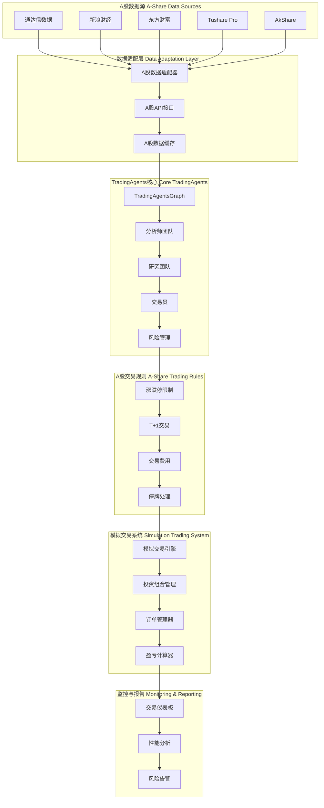

# TradingAgents A股接入与模拟炒股方案

## 📋 项目概述

本文档详细分析如何基于TradingAgents项目接入中国A股市场，实现智能分析模拟炒股功能。包括数据源适配、交易规则适配、模拟交易系统设计和实施方案。

---

## 🎯 目标与范围

### 🎯 主要目标
1. **A股数据接入** - 集成A股实时和历史数据
2. **交易规则适配** - 适配A股交易规则和市场特点
3. **模拟交易系统** - 构建完整的模拟交易平台
4. **智能分析增强** - 针对A股特点优化智能体分析
5. **风险控制** - 实现符合A股特点的风险管理

### 📊 项目范围
- **数据层**：A股行情数据、财务数据、新闻数据
- **分析层**：智能体分析和决策逻辑
- **交易层**：模拟交易执行和持仓管理
- **风控层**：风险监控和仓位管理
- **展示层**：交易结果展示和性能分析

---

## 🏗️ A股接入架构设计

### 📐 整体架构图



---

## 📊 A股数据源适配

### 1. 主要数据源分析

#### 🏆 Tushare Pro（推荐）
```python
# Tushare Pro数据适配器
import tushare as ts
import pandas as pd
from datetime import datetime, timedelta

class TushareDataAdapter:
    def __init__(self, token):
        self.token = token
        ts.set_token(token)
        self.pro = ts.pro_api()
    
    def get_stock_data(self, symbol, start_date, end_date):
        """获取A股股票历史数据"""
        # 转换股票代码格式
        ts_code = self._convert_symbol(symbol)
        
        # 获取日线数据
        df = self.pro.daily(ts_code=ts_code, 
                          start_date=start_date.replace('-', ''), 
                          end_date=end_date.replace('-', ''))
        
        # 数据格式转换
        df = self._format_data(df)
        return df.to_csv()
    
    def get_realtime_quote(self, symbol):
        """获取实时行情"""
        ts_code = self._convert_symbol(symbol)
        df = self.pro.realtime_quote(ts_code=ts_code)
        return df
    
    def get_financial_data(self, symbol):
        """获取财务数据"""
        ts_code = self._convert_symbol(symbol)
        
        # 获取最新财务指标
        df = self.pro.fina_indicator(ts_code=ts_code, 
                                  start_date='20200101', 
                                  end_date='20241231')
        return df
    
    def _convert_symbol(self, symbol):
        """转换股票代码格式"""
        if symbol.endswith('.SH') or symbol.endswith('.SZ'):
            return symbol
        elif symbol.startswith('6'):
            return f"{symbol}.SH"
        elif symbol.startswith('0') or symbol.startswith('3'):
            return f"{symbol}.SZ"
        else:
            raise ValueError(f"Unknown symbol format: {symbol}")
    
    def _format_data(self, df):
        """格式化数据"""
        # 重命名列
        df = df.rename(columns={
            'trade_date': 'Date',
            'open': 'Open',
            'high': 'High', 
            'low': 'Low',
            'close': 'Close',
            'vol': 'Volume'
        })
        
        # 排序和日期处理
        df = df.sort_values('Date')
        df['Date'] = pd.to_datetime(df['Date'])
        
        return df[['Date', 'Open', 'High', 'Low', 'Close', 'Volume']]
```

#### 🥈 AkShare（备选）
```python
# AkShare数据适配器
import akshare as ak
import pandas as pd

class AkShareDataAdapter:
    def __init__(self):
        self.cache = {}
    
    def get_stock_data(self, symbol, start_date, end_date):
        """获取A股历史数据"""
        try:
            # 获取股票历史数据
            df = ak.stock_zh_a_hist(symbol=symbol, 
                                 start_date=start_date, 
                                 end_date=end_date)
            
            # 格式化数据
            df = df.rename(columns={
                '日期': 'Date',
                '开盘': 'Open',
                '最高': 'High',
                '最低': 'Low', 
                '收盘': 'Close',
                '成交量': 'Volume'
            })
            
            return df.to_csv()
        except Exception as e:
            return f"Error retrieving data for {symbol}: {str(e)}"
    
    def get_realtime_quote(self, symbol):
        """获取实时行情"""
        try:
            df = ak.stock_zh_a_spot_em()
            stock_data = df[df['代码'] == symbol]
            return stock_data
        except Exception as e:
            return f"Error getting quote for {symbol}: {str(e)}"
```

### 2. 数据适配器集成

```python
# tradingagents/dataflows/a_share.py
from typing import Annotated
from datetime import datetime
import pandas as pd

class AShareDataAdapter:
    """A股数据适配器"""
    
    def __init__(self, config):
        self.config = config
        self.primary_source = config.get('a_share_primary_source', 'tushare')
        self.fallback_source = config.get('a_share_fallback_source', 'akshare')
        
        # 初始化数据源
        if self.primary_source == 'tushare':
            self.tushare_adapter = TushareDataAdapter(config['tushare_token'])
        if self.fallback_source == 'akshare':
            self.akshare_adapter = AkShareDataAdapter()
    
    def get_a_share_data(
        symbol: Annotated[str, "A股股票代码"],
        start_date: Annotated[str, "开始日期 YYYY-MM-DD"],
        end_date: Annotated[str, "结束日期 YYYY-MM-DD"],
    ) -> str:
        """获取A股股票数据"""
        
        try:
            # 尝试主数据源
            if self.primary_source == 'tushare':
                data = self.tushare_adapter.get_stock_data(symbol, start_date, end_date)
            else:
                data = self.akshare_adapter.get_stock_data(symbol, start_date, end_date)
            
            # 验证数据有效性
            if self._validate_data(data):
                return data
            else:
                # 尝试备用数据源
                return self._try_fallback_source(symbol, start_date, end_date)
                
        except Exception as e:
            # 主数据源失败，尝试备用数据源
            return self._try_fallback_source(symbol, start_date, end_date)
    
    def get_a_share_indicators(
        symbol: Annotated[str, "A股股票代码"],
        indicator: Annotated[str, "技术指标"],
        curr_date: Annotated[str, "当前日期"],
        look_back_days: Annotated[int, "回看天数"],
    ) -> str:
        """获取A股技术指标"""
        
        # 获取历史数据
        end_date = datetime.strptime(curr_date, "%Y-%m-%d")
        start_date = (end_date - timedelta(days=look_back_days*2)).strftime("%Y-%m-%d")
        
        data_csv = self.get_a_share_data(symbol, start_date, curr_date)
        
        # 计算技术指标
        df = pd.read_csv(pd.compat.StringIO(data_csv))
        
        if indicator == 'rsi':
            return self._calculate_rsi(df)
        elif indicator == 'macd':
            return self._calculate_macd(df)
        elif indicator == 'bollinger':
            return self._calculate_bollinger_bands(df)
        else:
            return f"Indicator {indicator} not supported for A-shares"
    
    def _validate_data(self, data):
        """验证数据有效性"""
        try:
            df = pd.read_csv(pd.compat.StringIO(data))
            return len(df) > 0 and not df.empty
        except:
            return False
    
    def _try_fallback_source(self, symbol, start_date, end_date):
        """尝试备用数据源"""
        try:
            if self.fallback_source == 'akshare':
                return self.akshare_adapter.get_stock_data(symbol, start_date, end_date)
            else:
                return f"No fallback data available for {symbol}"
        except Exception as e:
            return f"All data sources failed for {symbol}: {str(e)}"
```

---

## 🏛️ A股交易规则适配

### 1. 涨跌停限制

```python
# tradingagents/trading/a_share_rules.py
import pandas as pd
from datetime import datetime, timedelta

class AShareTradingRules:
    """A股交易规则适配器"""
    
    def __init__(self):
        self.price_limits = {
            'ST': 0.05,    # ST股票涨跌幅限制5%
            '*ST': 0.05,   # *ST股票涨跌幅限制5%
            'normal': 0.10,  # 普通股票涨跌幅限制10%
            '创业板': 0.20,   # 创业板20%
            '科创板': 0.20,   # 科创板20%
            '北交所': 0.30,   # 北交所30%
        }
    
    def check_price_limit(self, symbol, current_price, reference_price):
        """检查涨跌停限制"""
        stock_type = self._get_stock_type(symbol)
        limit = self.price_limits.get(stock_type, 0.10)
        
        max_price = reference_price * (1 + limit)
        min_price = reference_price * (1 - limit)
        
        return {
            'can_buy': current_price < max_price,
            'can_sell': current_price > min_price,
            'max_price': max_price,
            'min_price': min_price,
            'price_limit': limit,
            'stock_type': stock_type
        }
    
    def calculate_trading_fees(self, price, volume, side='buy'):
        """计算交易费用"""
        amount = price * volume
        
        # 佣金费率（双向收取）
        commission_rate = 0.00025  # 万分之2.5
        commission = max(amount * commission_rate, 5)  # 最低5元
        
        # 印花税（卖出时收取）
        stamp_tax = amount * 0.001 if side == 'sell' else 0
        
        # 过户费（上海股票收取）
        transfer_fee = amount * 0.00002 if self._is_sh_stock(symbol) else 0
        
        total_fees = commission + stamp_tax + transfer_fee
        
        return {
            'commission': commission,
            'stamp_tax': stamp_tax,
            'transfer_fee': transfer_fee,
            'total_fees': total_fees,
            'net_amount': amount - total_fees if side == 'buy' else amount - total_fees
        }
    
    def check_t_plus1(self, symbol, buy_date, sell_date):
        """检查T+1交易限制"""
        buy_dt = datetime.strptime(buy_date, "%Y-%m-%d")
        sell_dt = datetime.strptime(sell_date, "%Y-%m-%d")
        
        # T+1规则：买入后下一个交易日才能卖出
        min_sell_date = buy_dt + timedelta(days=1)
        
        # 考虑非交易日
        while min_sell_date.weekday() >= 5:  # 周末
            min_sell_date += timedelta(days=1)
        
        return {
            'can_sell': sell_dt >= min_sell_date,
            'min_sell_date': min_sell_date.strftime("%Y-%m-%d"),
            'days_to_sell': (sell_dt - min_sell_date).days
        }
    
    def _get_stock_type(self, symbol):
        """判断股票类型"""
        if symbol.startswith('688'):
            return '科创板'
        elif symbol.startswith('300') or symbol.startswith('301'):
            return '创业板'
        elif symbol.startswith('8'):
            return '北交所'
        elif 'ST' in symbol:
            return 'ST'
        elif '*ST' in symbol:
            return '*ST'
        else:
            return 'normal'
    
    def _is_sh_stock(self, symbol):
        """判断是否为上海股票"""
        return symbol.startswith('6') or symbol.startswith('688')
```

### 2. 交易时间管理

```python
# tradingagents/trading/trading_calendar.py
import pandas as pd
from datetime import datetime, timedelta

class TradingCalendar:
    """A股交易日历管理"""
    
    def __init__(self):
        self.holidays = self._load_holidays()
        self.trading_sessions = {
            'morning': {'start': '09:30', 'end': '11:30'},
            'afternoon': {'start': '13:00', 'end': '15:00'}
        }
    
    def is_trading_day(self, date):
        """判断是否为交易日"""
        date_obj = datetime.strptime(date, "%Y-%m-%d")
        
        # 检查是否为周末
        if date_obj.weekday() >= 5:
            return False
        
        # 检查是否为节假日
        return date not in self.holidays
    
    def is_trading_time(self, current_time=None):
        """判断是否为交易时间"""
        if current_time is None:
            current_time = datetime.now()
        
        time_str = current_time.strftime("%H:%M")
        date_str = current_time.strftime("%Y-%m-%d")
        
        # 检查是否为交易日
        if not self.is_trading_day(date_str):
            return False
        
        # 检查是否在交易时间段内
        morning_start = self.trading_sessions['morning']['start']
        morning_end = self.trading_sessions['morning']['end']
        afternoon_start = self.trading_sessions['afternoon']['start']
        afternoon_end = self.trading_sessions['afternoon']['end']
        
        return (morning_start <= time_str <= morning_end) or \
               (afternoon_start <= time_str <= afternoon_end)
    
    def get_next_trading_day(self, date):
        """获取下一个交易日"""
        current_date = datetime.strptime(date, "%Y-%m-%d")
        next_date = current_date + timedelta(days=1)
        
        while not self.is_trading_day(next_date.strftime("%Y-%m-%d")):
            next_date += timedelta(days=1)
        
        return next_date.strftime("%Y-%m-%d")
    
    def _load_holidays(self):
        """加载节假日数据"""
        # 这里可以从文件或API加载节假日数据
        # 示例数据
        return {
            '2024-01-01', '2024-02-10', '2024-02-11', '2024-02-12',
            '2024-04-04', '2024-04-05', '2024-04-06',
            '2024-05-01', '2024-05-02', '2024-05-03',
            '2024-06-10', '2024-10-01', '2024-10-02', '2024-10-03'
        }
```

---

## 🎮 模拟交易系统设计

### 1. 模拟交易引擎

```python
# tradingagents/trading/simulator.py
import pandas as pd
from datetime import datetime
from typing import Dict, List, Optional
import uuid

class TradingSimulator:
    """A股模拟交易引擎"""
    
    def __init__(self, initial_capital: float = 1000000):
        self.initial_capital = initial_capital
        self.current_capital = initial_capital
        self.positions = {}  # 持仓信息
        self.orders = []     # 订单历史
        self.trades = []     # 成交记录
        self.daily_pnl = []  # 每日盈亏
        
        # 初始化交易规则和日历
        self.trading_rules = AShareTradingRules()
        self.calendar = TradingCalendar()
    
    def place_order(self, symbol: str, side: str, quantity: int, 
                   price: Optional[float] = None, order_type: str = 'market') -> str:
        """下单"""
        
        order_id = str(uuid.uuid4())
        
        # 获取当前价格
        if price is None:
            current_price = self._get_current_price(symbol)
        else:
            current_price = price
        
        # 验证订单
        validation = self._validate_order(symbol, side, quantity, current_price)
        if not validation['valid']:
            return {'error': validation['message']}
        
        # 创建订单
        order = {
            'order_id': order_id,
            'symbol': symbol,
            'side': side,
            'quantity': quantity,
            'price': current_price,
            'order_type': order_type,
            'status': 'pending',
            'created_at': datetime.now(),
            'updated_at': datetime.now()
        }
        
        self.orders.append(order)
        
        # 执行订单
        execution_result = self._execute_order(order)
        
        return {
            'order_id': order_id,
            'status': execution_result['status'],
            'message': execution_result['message']
        }
    
    def _execute_order(self, order: Dict) -> Dict:
        """执行订单"""
        symbol = order['symbol']
        side = order['side']
        quantity = order['quantity']
        price = order['price']
        
        # 计算交易费用
        fees = self.trading_rules.calculate_trading_fees(price, quantity, side)
        
        # 计算总金额
        total_amount = price * quantity + fees['total_fees']
        
        if side == 'buy':
            # 买入订单
            if self.current_capital < total_amount:
                return {'status': 'rejected', 'message': 'Insufficient capital'}
            
            # 扣除资金
            self.current_capital -= total_amount
            
            # 更新持仓
            if symbol not in self.positions:
                self.positions[symbol] = {
                    'quantity': 0,
                    'avg_cost': 0,
                    'total_cost': 0
                }
            
            old_quantity = self.positions[symbol]['quantity']
            old_total_cost = self.positions[symbol]['total_cost']
            
            new_quantity = old_quantity + quantity
            new_total_cost = old_total_cost + total_amount
            new_avg_cost = new_total_cost / new_quantity
            
            self.positions[symbol] = {
                'quantity': new_quantity,
                'avg_cost': new_avg_cost,
                'total_cost': new_total_cost
            }
            
        else:  # sell
            # 卖出订单
            if symbol not in self.positions or self.positions[symbol]['quantity'] < quantity:
                return {'status': 'rejected', 'message': 'Insufficient position'}
            
            # 检查T+1限制
            buy_date = self._get_buy_date(symbol, quantity)
            if buy_date:
                current_date = datetime.now().strftime("%Y-%m-%d")
                t_plus_check = self.trading_rules.check_t_plus1(symbol, buy_date, current_date)
                if not t_plus_check['can_sell']:
                    return {'status': 'rejected', 'message': 'T+1 restriction'}
            
            # 计算收益
            position = self.positions[symbol]
            cost_basis = position['avg_cost'] * quantity
            proceeds = price * quantity - fees['total_fees']
            pnl = proceeds - cost_basis
            
            # 更新资金
            self.current_capital += proceeds
            
            # 更新持仓
            remaining_quantity = position['quantity'] - quantity
            if remaining_quantity == 0:
                del self.positions[symbol]
            else:
                remaining_cost = position['total_cost'] - cost_basis
                self.positions[symbol] = {
                    'quantity': remaining_quantity,
                    'avg_cost': remaining_cost / remaining_quantity,
                    'total_cost': remaining_cost
                }
        
        # 记录成交
        trade = {
            'trade_id': str(uuid.uuid4()),
            'order_id': order['order_id'],
            'symbol': symbol,
            'side': side,
            'quantity': quantity,
            'price': price,
            'fees': fees,
            'executed_at': datetime.now()
        }
        
        self.trades.append(trade)
        
        # 更新订单状态
        order['status'] = 'executed'
        order['executed_at'] = datetime.now()
        order['updated_at'] = datetime.now()
        
        return {'status': 'executed', 'message': 'Order executed successfully'}
    
    def get_portfolio_value(self) -> Dict:
        """获取投资组合价值"""
        total_value = self.current_capital
        position_values = {}
        
        for symbol, position in self.positions.items():
            current_price = self._get_current_price(symbol)
            market_value = current_price * position['quantity']
            position_values[symbol] = {
                'quantity': position['quantity'],
                'avg_cost': position['avg_cost'],
                'current_price': current_price,
                'market_value': market_value,
                'pnl': market_value - position['total_cost'],
                'pnl_percent': ((market_value - position['total_cost']) / position['total_cost']) * 100
            }
            total_value += market_value
        
        return {
            'total_value': total_value,
            'cash': self.current_capital,
            'positions': position_values,
            'total_pnl': total_value - self.initial_capital,
            'total_pnl_percent': ((total_value - self.initial_capital) / self.initial_capital) * 100
        }
    
    def _validate_order(self, symbol: str, side: str, quantity: int, price: float) -> Dict:
        """验证订单"""
        # 检查交易时间
        if not self.calendar.is_trading_time():
            return {'valid': False, 'message': 'Market is closed'}
        
        # 检查涨跌停
        reference_price = self._get_reference_price(symbol)
        limit_check = self.trading_rules.check_price_limit(symbol, price, reference_price)
        
        if side == 'buy' and not limit_check['can_buy']:
            return {'valid': False, 'message': f'Price exceeds limit up {limit_check["max_price"]}'}
        elif side == 'sell' and not limit_check['can_sell']:
            return {'valid': False, 'message': f'Price below limit down {limit_check["min_price"]}'}
        
        # 检查最小交易单位
        if quantity % 100 != 0:
            return {'valid': False, 'message': 'Quantity must be multiple of 100'}
        
        return {'valid': True, 'message': 'Order is valid'}
    
    def _get_current_price(self, symbol: str) -> float:
        """获取当前价格（模拟）"""
        # 这里应该从数据源获取实时价格
        # 为了演示，返回模拟价格
        return 10.50
    
    def _get_reference_price(self, symbol: str) -> float:
        """获取参考价格（前收盘价）"""
        # 这里应该从数据源获取前收盘价
        return 10.00
```

### 2. 投资组合管理

```python
# tradingagents/trading/portfolio.py
import pandas as pd
from datetime import datetime
import numpy as np

class PortfolioManager:
    """投资组合管理器"""
    
    def __init__(self, simulator: TradingSimulator):
        self.simulator = simulator
        self.performance_history = []
        self.risk_metrics = {}
    
    def rebalance_portfolio(self, target_weights: Dict[str, float]) -> Dict:
        """投资组合再平衡"""
        current_portfolio = self.simulator.get_portfolio_value()
        total_value = current_portfolio['total_value']
        
        rebalance_orders = []
        
        for symbol, target_weight in target_weights.items():
            target_value = total_value * target_weight
            current_position = current_portfolio['positions'].get(symbol, {'market_value': 0})
            current_value = current_position['market_value']
            
            diff_value = target_value - current_value
            current_price = self.simulator._get_current_price(symbol)
            
            if abs(diff_value) > current_price * 100:  # 最小交易单位
                quantity = int(diff_value / current_price / 100) * 100  # 手数调整
                
                if quantity > 0:
                    rebalance_orders.append({
                        'symbol': symbol,
                        'side': 'buy',
                        'quantity': quantity
                    })
                elif quantity < 0:
                    rebalance_orders.append({
                        'symbol': symbol,
                        'side': 'sell',
                        'quantity': abs(quantity)
                    })
        
        # 执行再平衡订单
        results = []
        for order in rebalance_orders:
            result = self.simulator.place_order(**order)
            results.append(result)
        
        return {
            'rebalance_orders': rebalance_orders,
            'execution_results': results,
            'target_weights': target_weights,
            'total_value': total_value
        }
    
    def calculate_performance_metrics(self) -> Dict:
        """计算绩效指标"""
        portfolio_history = self.simulator.daily_pnl
        
        if not portfolio_history:
            return {}
        
        # 计算日收益率
        daily_returns = [p['daily_return'] for p in portfolio_history]
        
        # 基础指标
        total_return = portfolio_history[-1]['total_return']
        annualized_return = (1 + total_return) ** (252 / len(portfolio_history)) - 1
        
        # 风险指标
        volatility = np.std(daily_returns) * np.sqrt(252)
        sharpe_ratio = annualized_return / volatility if volatility > 0 else 0
        
        # 最大回撤
        cumulative_returns = np.cumprod([1 + r for r in daily_returns])
        peak = np.maximum.accumulate(cumulative_returns)
        drawdown = (cumulative_returns - peak) / peak
        max_drawdown = np.min(drawdown)
        
        return {
            'total_return': total_return,
            'annualized_return': annualized_return,
            'volatility': volatility,
            'sharpe_ratio': sharpe_ratio,
            'max_drawdown': max_drawdown,
            'current_value': portfolio_history[-1]['total_value'],
            'trading_days': len(portfolio_history)
        }
    
    def risk_analysis(self) -> Dict:
        """风险分析"""
        current_portfolio = self.simulator.get_portfolio_value()
        positions = current_portfolio['positions']
        
        # 集中度风险
        concentration_risk = {}
        total_value = current_portfolio['total_value']
        
        for symbol, position in positions.items():
            weight = position['market_value'] / total_value
            concentration_risk[symbol] = weight
        
        # 行业分布（需要行业数据）
        sector_distribution = self._analyze_sector_distribution(positions)
        
        # 风险价值（VaR）计算
        var_95 = self._calculate_var(0.95)
        
        return {
            'concentration_risk': concentration_risk,
            'sector_distribution': sector_distribution,
            'var_95': var_95,
            'total_positions': len(positions),
            'cash_ratio': current_portfolio['cash'] / total_value
        }
```

---

## 🤖 智能体A股适配

### 1. A股分析师适配

```python
# tradingagents/agents/analysts/a_share_analyst.py
from langchain_core.prompts import ChatPromptTemplate
from tradingagents.dataflows.a_share import AShareDataAdapter

def create_a_share_market_analyst(llm):
    """创建A股市场分析师"""
    
    def a_share_market_analyst_node(state):
        current_date = state["trade_date"]
        ticker = state["company_of_interest"]
        
        tools = [
            get_a_share_data,
            get_a_share_indicators,
        ]
        
        system_message = """
        你是一个专业的A股市场分析师。你的任务是分析A股市场的技术面和基本面情况。
        
        A股市场特点：
        1. 涨跌停限制：普通股票±10%，ST股票±5%，创业板/科创板±20%
        2. T+1交易制度：买入后下一个交易日才能卖出
        3. 交易时间：9:30-11:30, 13:00-15:00
        4. 最小交易单位：100股（1手）
        5. 交易费用：佣金万2.5，印花税千1（卖出），过户费万0.2（沪市）
        
        分析重点：
        - 技术指标分析：重点关注适合A股的指标（如MACD、RSI、布林带）
        - 价格行为：关注涨跌停板对价格走势的影响
        - 成交量分析：A股成交量对价格走势的重要影响
        - 板块轮动：A股市场特有的板块轮动现象
        - 政策影响：政策对A股市场的重大影响
        
        请使用get_a_share_data获取股票数据，然后使用get_a_share_indicators获取技术指标。
        提供详细、专业的A股分析报告，包括买卖建议和风险提示。
        """
        
        prompt = ChatPromptTemplate.from_messages([
            ("system", system_message),
            ("human", "请分析股票{ticker}在{current_date}的A股市场情况"),
            ("placeholder", "{messages}")
        ])
        
        chain = prompt | llm | tools
        
        result = chain.invoke({
            "ticker": ticker,
            "current_date": current_date,
            "messages": state["messages"]
        })
        
        return {
            **state,
            "market_report": result,
            "sender": "A-Share Market Analyst"
        }
    
    return a_share_market_analyst_node
```

### 2. A股新闻分析师

```python
# tradingagents/agents/analysts/a_share_news_analyst.py
import akshare as ak
import pandas as pd

def create_a_share_news_analyst(llm):
    """创建A股新闻分析师"""
    
    def a_share_news_analyst_node(state):
        current_date = state["trade_date"]
        ticker = state["company_of_interest"]
        
        tools = [
            get_a_share_news,
            get_a_share_policy_news,
        ]
        
        system_message = """
        你是一个专业的A股新闻分析师，专注于分析影响A股市场的新闻和政策。
        
        A股新闻特点：
        1. 政策敏感：A股市场对政策变化高度敏感
        2. 官媒影响：人民日报、新华社等官媒报道影响重大
        3. 财报季报：季报、年报对个股影响显著
        4. 重组并购：A股重组并购活动频繁
        5. 监管动态：证监会、银保监会监管政策影响
        
        分析重点：
        - 政策解读：分析政策对市场和个股的影响
        - 公司公告：重要公告（业绩预告、重大合同等）
        - 宏观经济：宏观经济数据对A股的影响
        - 行业动态：行业发展政策和趋势
        - 市场情绪：市场情绪指标和资金流向
        
        请使用get_a_share_news获取公司相关新闻，使用get_a_share_policy_news获取政策新闻。
        提供专业的A股新闻分析报告，包括对股价的潜在影响。
        """
        
        prompt = ChatPromptTemplate.from_messages([
            ("system", system_message),
            ("human", "请分析股票{ticker}在{current_date}的相关新闻和市场影响"),
            ("placeholder", "{messages}")
        ])
        
        chain = prompt | llm | tools
        
        result = chain.invoke({
            "ticker": ticker,
            "current_date": current_date,
            "messages": state["messages"]
        })
        
        return {
            **state,
            "news_report": result,
            "sender": "A-Share News Analyst"
        }
    
    return a_share_news_analyst_node

def get_a_share_news(symbol: str, days: int = 7) -> str:
    """获取A股相关新闻"""
    try:
        # 使用AkShare获取股票新闻
        news_df = ak.stock_news_em()
        
        # 筛选相关新闻
        symbol_news = news_df[news_df['title'].str.contains(symbol, na=False)]
        
        if symbol_news.empty:
            return f"未找到股票{symbol}的相关新闻"
        
        # 格式化新闻
        news_text = ""
        for _, row in symbol_news.head(10).iterrows():
            news_text += f"标题: {row['title']}\n"
            news_text += f"时间: {row['time']}\n"
            news_text += f"内容: {row['content']}\n\n"
        
        return news_text
        
    except Exception as e:
        return f"获取新闻失败: {str(e)}"

def get_a_share_policy_news(days: int = 7) -> str:
    """获取A股政策新闻"""
    try:
        # 获取财经要闻
        policy_news = ak.stock_news_cj()
        
        # 格式化政策新闻
        news_text = ""
        for _, row in policy_news.head(20).iterrows():
            news_text += f"标题: {row['title']}\n"
            news_text += f"时间: {row['time']}\n"
            news_text += f"内容: {row['content']}\n\n"
        
        return news_text
        
    except Exception as e:
        return f"获取政策新闻失败: {str(e)}"
```

---

## 📊 配置文件适配

### 1. A股配置文件

```python
# tradingagents/a_share_config.py
import os

A_SHARE_CONFIG = {
    "project_dir": os.path.abspath(os.path.join(os.path.dirname(__file__), ".")),
    "results_dir": os.getenv("TRADINGAGENTS_RESULTS_DIR", "./results"),
    "data_cache_dir": os.path.join(
        os.path.abspath(os.path.join(os.path.dirname(__file__), ".")),
        "dataflows/data_cache",
    ),
    
    # LLM settings
    "llm_provider": "openai",
    "deep_think_llm": "gpt-4o",
    "quick_think_llm": "gpt-4o-mini",
    "backend_url": "https://api.openai.com/v1",
    
    # A股特定配置
    "market": "a_share",
    "currency": "CNY",
    "trading_calendar": "cn",
    
    # A股数据源配置
    "a_share_primary_source": "tushare",
    "a_share_fallback_source": "akshare",
    "tushare_token": os.getenv("TUSHARE_TOKEN", ""),
    
    # A股交易规则配置
    "trading_rules": {
        "price_limit_normal": 0.10,    # 普通股票涨跌幅限制
        "price_limit_st": 0.05,        # ST股票涨跌幅限制
        "price_limit_gem": 0.20,       # 创业板涨跌幅限制
        "price_limit_star": 0.20,     # 科创板涨跌幅限制
        "commission_rate": 0.00025,     # 佣金费率
        "stamp_tax_rate": 0.001,       # 印花税率
        "transfer_fee_rate": 0.00002,  # 过户费率
        "min_commission": 5,           # 最低佣金
        "min_lot_size": 100,           # 最小交易单位
    },
    
    # 模拟交易配置
    "simulation": {
        "initial_capital": 1000000,    # 初始资金
        "commission_rate": 0.00025,     # 模拟交易佣金率
        "slippage_rate": 0.001,        # 滑点率
        "enable_short": False,          # 是否允许做空
        "enable_margin": False,         # 是否允许融资融券
    },
    
    # 数据供应商配置
    "data_vendors": {
        "core_stock_apis": "a_share",       # 使用A股数据源
        "technical_indicators": "a_share",  # 使用A股技术指标
        "fundamental_data": "a_share",      # 使用A股财务数据
        "news_data": "a_share",            # 使用A股新闻数据
    },
    
    # 智能体配置
    "selected_analysts": [
        "a_share_market",
        "a_share_news", 
        "a_share_fundamentals"
    ],
    
    # 风险管理配置
    "risk_management": {
        "max_position_size": 0.10,        # 单股最大仓位
        "max_total_position": 0.95,      # 最大总仓位
        "stop_loss_rate": 0.05,          # 止损比例
        "take_profit_rate": 0.20,        # 止盈比例
        "max_daily_loss": 0.02,          # 日最大亏损
    },
}
```

### 2. 环境变量配置

```bash
# .env 文件添加A股配置

# LLM API配置
OPENAI_API_KEY=your_openai_api_key

# A股数据源配置
TUSHARE_TOKEN=your_tushare_token
AKSHARE_API_KEY=your_akshare_key

# A股交易配置
A_SHARE_INITIAL_CAPITAL=1000000
A_SHARE_MAX_POSITION_SIZE=0.10
A_SHARE_COMMISSION_RATE=0.00025

# 缓存配置
TRADINGAGENTS_DATA_DIR=./data/a_share
TRADINGAGENTS_RESULTS_DIR=./results/a_share
```

---

## 🚀 实施步骤

### 第一阶段：数据接入（1-2周）

#### 1.1 数据源集成
- [ ] 注册Tushare Pro账号并获取Token
- [ ] 实现Tushare数据适配器
- [ ] 实现AkShare备用数据源
- [ ] 配置数据缓存和更新机制

#### 1.2 数据验证
- [ ] 测试股票数据获取准确性
- [ ] 验证技术指标计算
- [ ] 测试数据源故障转移
- [ ] 建立数据质量监控

### 第二阶段：交易规则适配（1周）

#### 2.1 交易规则实现
- [ ] 实现涨跌停限制检查
- [ ] 实现T+1交易限制
- [ ] 实现交易费用计算
- [ ] 实现交易日历管理

#### 2.2 规则验证
- [ ] 测试各种交易场景
- [ ] 验证费用计算准确性
- [ ] 测试异常情况处理

### 第三阶段：模拟交易系统（2-3周）

#### 3.1 交易引擎开发
- [ ] 实现订单管理系统
- [ ] 实现持仓管理
- [ ] 实现盈亏计算
- [ ] 实现风险控制

#### 3.2 投资组合管理
- [ ] 实现投资组合分析
- [ ] 实现绩效指标计算
- [ ] 实现风险分析
- [ ] 实现再平衡功能

### 第四阶段：智能体适配（2周）

#### 4.1 分析师适配
- [ ] 适配A股市场分析师
- [ ] 适配A股新闻分析师
- [ ] 适配A股基本面分析师
- [ ] 优化提示词和工具

#### 4.2 系统集成
- [ ] 集成A股数据适配器
- [ ] 配置A股交易规则
- [ ] 测试完整工作流
- [ ] 性能优化

### 第五阶段：测试和部署（1-2周）

#### 5.1 系统测试
- [ ] 单元测试
- [ ] 集成测试
- [ ] 压力测试
- [ ] 回测验证

#### 5.2 生产部署
- [ ] 生产环境配置
- [ ] 监控告警设置
- [ ] 用户培训
- [ ] 文档完善

---

## 📈 预期效果

### 🎯 功能特性
- **完整A股支持** - 覆盖沪深两市所有股票
- **智能分析** - AI驱动的市场分析和决策
- **模拟交易** - 完整的模拟交易平台
- **风险控制** - 多层次风险管理机制
- **绩效分析** - 详细的交易绩效分析

### 📊 价值体现
- **降低交易风险** - 智能分析和风险控制
- **提高决策质量** - 多智能体协作决策
- **节省研究时间** - 自动化市场分析
- **优化投资组合** - 科学的资产配置
- **学习交易经验** - AI持续学习和优化

---

## 🔧 技术支持

### 📞 获取帮助
- **项目文档**: 参考完整的技术文档
- **GitHub Issues**: 提交技术问题和建议
- **社区支持**: 加入TradingAgents社区
- **商业支持**: 联系专业技术团队

### 📚 学习资源
- **A股市场知识**: 学习A股交易规则和特点
- **Python编程**: 掌握Python数据分析技能
- **机器学习**: 了解AI在金融中的应用
- **量化交易**: 学习量化交易策略开发

---

本方案为TradingAgents项目接入A股市场提供了完整的技术路线图，涵盖了数据接入、规则适配、模拟交易和智能分析等所有关键环节。通过实施本方案，可以构建一个功能完整、智能高效的A股模拟交易平台。