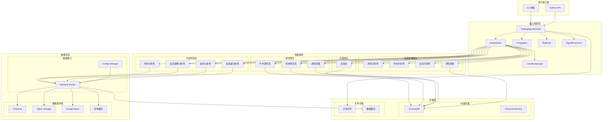
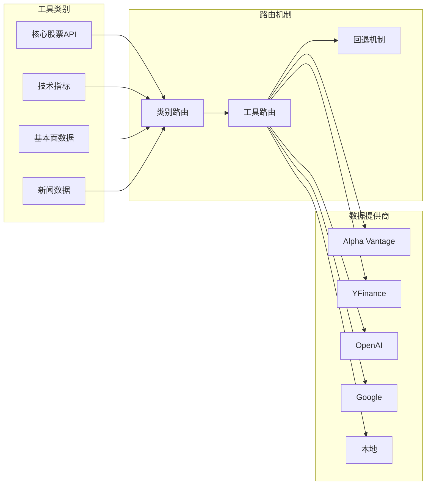
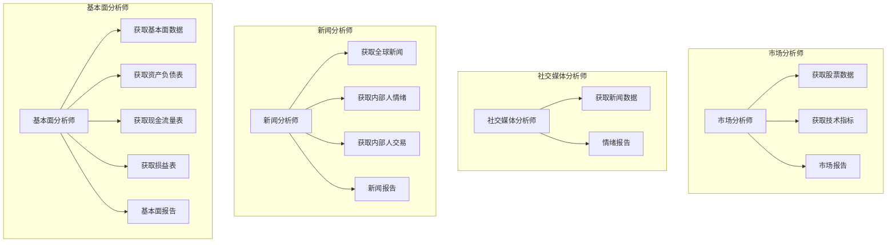
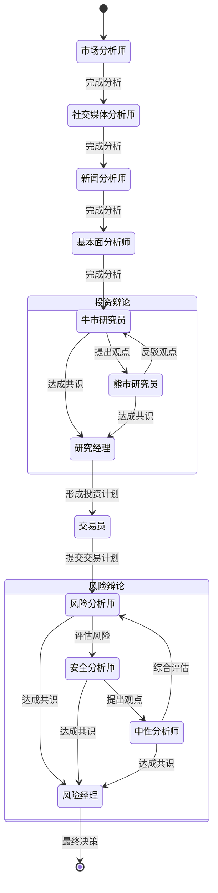

# TradingAgents 架构设计文档

## 1. 系统概述

TradingAgents是一个基于LangGraph/LangChain的多智能体金融交易框架，模拟真实交易公司的运作模式。系统通过部署专门的LLM驱动的智能体（基本面分析师、情绪专家、技术分析师等）来协作评估市场条件并做出交易决策。

## 2. 核心架构

### 2.1 整体架构图



### 2.2 核心组件架构

#### 2.2.1 TradingAgentsGraph (主控制器)
```python
class TradingAgentsGraph:
    """主控制器，协调所有组件"""
    - 初始化LLM和内存
    - 创建工具节点
    - 设置工作流图
    - 执行传播和反思
```

#### 2.2.2 GraphSetup (工作流设置)
```python
class GraphSetup:
    """工作流设置和配置"""
    - 创建智能体节点
    - 定义边缘连接
    - 编译LangGraph工作流
```

#### 2.2.3 数据流架构


## 3. 智能体架构详细设计

### 3.1 分析师团队


### 3.2 工作流状态机


## 4. 数据架构设计

### 4.1 状态管理
```python
class AgentState(MessagesState):
    """智能体状态管理"""
    company_of_interest: str  # 目标公司
    trade_date: str          # 交易日期
    sender: str              # 发送者
    
    # 分析师报告
    market_report: str
    sentiment_report: str
    news_report: str
    fundamentals_report: str
    
    # 投资辩论状态
    investment_debate_state: InvestDebateState
    investment_plan: str
    
    # 交易员计划
    trader_investment_plan: str
    
    # 风险辩论状态
    risk_debate_state: RiskDebateState
    final_trade_decision: str
```

### 4.2 内存管理
```python
class FinancialSituationMemory:
    """金融情境记忆管理"""
    - ChromaDB向量存储
    - OpenAI嵌入
    - 反思和学习机制
    - 历史经验检索
```

## 5. 配置架构

### 5.1 配置层次结构
```yaml
default_config:
  # 项目目录配置
  project_dir: str
  results_dir: str
  data_cache_dir: str
  
  # LLM配置
  llm_provider: str
  deep_think_llm: str
  quick_think_llm: str
  backend_url: str
  
  # 辩论配置
  max_debate_rounds: int
  max_risk_discuss_rounds: int
  max_recur_limit: int
  
  # 数据供应商配置
  data_vendors:
    core_stock_apis: str
    technical_indicators: str
    fundamental_data: str
    news_data: str
  
  # 工具级配置
  tool_vendors: dict
```

## 6. 扩展性设计

### 6.1 新智能体添加
1. 创建智能体函数
2. 在GraphSetup中注册节点
3. 更新工作流边缘
4. 添加相关工具

### 6.2 新数据源集成
1. 实现数据提供者接口
2. 在interface.py中注册方法
3. 更新配置选项
4. 添加回退逻辑

### 6.3 新LLM提供商支持
1. 在trading_graph.py中添加初始化逻辑
2. 创建相应的Chat模型实例
3. 更新配置验证

## 7. 安全性设计

### 7.1 API密钥管理
- 环境变量加载
- .env文件支持
- 密钥验证

### 7.2 数据安全
- 本地缓存加密
- 敏感数据脱敏
- 访问权限控制

## 8. 性能优化

### 8.1 缓存策略
- 多级缓存机制
- 数据过期策略
- 内存优化

### 8.2 并发处理
- 异步数据获取
- 智能体并行执行
- 资源池管理

## 9. 监控和日志

### 9.1 日志系统
- 结构化日志
- 多级别日志
- 文件轮转

### 9.2 性能监控
- API调用统计
- 响应时间监控
- 错误率追踪

这个架构设计确保了系统的模块化、可扩展性和可维护性，为金融交易决策提供了强大而灵活的框架支持。