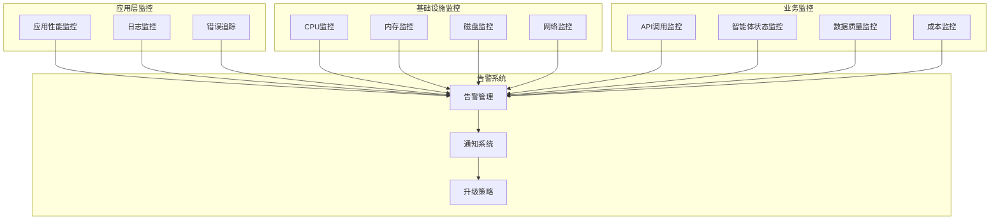
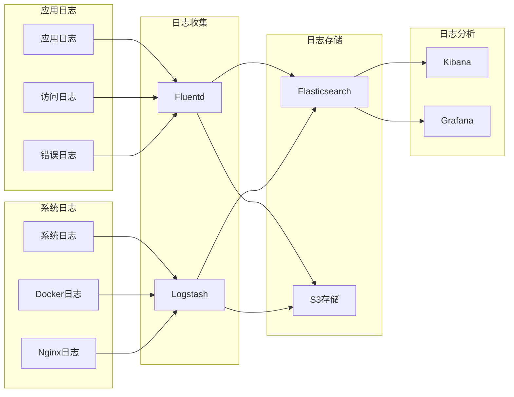
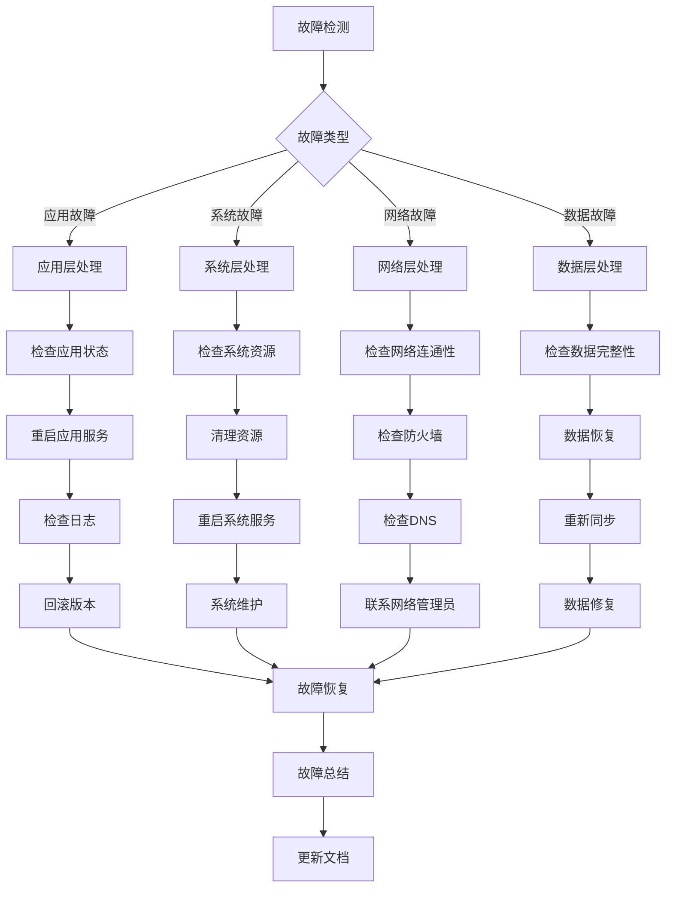

# TradingAgents 运维手册

## 1. 运维概述

本手册提供TradingAgents系统的完整运维指南，包括监控、维护、故障处理、性能优化和安全管理等方面的最佳实践。

## 2. 监控体系

### 2.1 监控架构



### 2.2 关键指标监控

#### 应用性能指标
```python
# 监控指标定义
MONITORING_METRICS = {
    # 响应时间
    'api_response_time': {
        'threshold': 5.0,  # 秒
        'unit': 'seconds',
        'description': 'API平均响应时间'
    },
    
    # 吞吐量
    'requests_per_minute': {
        'threshold': 100,
        'unit': 'rpm',
        'description': '每分钟请求数'
    },
    
    # 错误率
    'error_rate': {
        'threshold': 0.05,  # 5%
        'unit': 'percentage',
        'description': '错误请求比例'
    },
    
    # 智能体执行时间
    'agent_execution_time': {
        'threshold': 300,  # 秒
        'unit': 'seconds',
        'description': '单个智能体执行时间'
    },
    
    # 内存使用
    'memory_usage': {
        'threshold': 0.8,  # 80%
        'unit': 'percentage',
        'description': '内存使用率'
    },
    
    # API调用次数
    'api_calls_per_hour': {
        'threshold': 1000,
        'unit': 'calls',
        'description': '每小时API调用次数'
    }
}
```

#### 业务指标监控
```python
# 业务监控指标
BUSINESS_METRICS = {
    # 决策质量
    'decision_accuracy': {
        'threshold': 0.7,
        'unit': 'percentage',
        'description': '交易决策准确率'
    },
    
    # 数据新鲜度
    'data_freshness': {
        'threshold': 300,  # 秒
        'unit': 'seconds',
        'description': '数据延迟时间'
    },
    
    # 智能体成功率
    'agent_success_rate': {
        'threshold': 0.95,
        'unit': 'percentage',
        'description': '智能体执行成功率'
    },
    
    # 成本控制
    'cost_per_analysis': {
        'threshold': 1.0,  # 美元
        'unit': 'USD',
        'description': '单次分析成本'
    }
}
```

### 2.3 Prometheus监控配置

#### 监控配置文件
```yaml
# prometheus.yml
global:
  scrape_interval: 15s
  evaluation_interval: 15s

rule_files:
  - "tradingagents_rules.yml"

alerting:
  alertmanagers:
    - static_configs:
        - targets:
          - alertmanager:9093

scrape_configs:
  - job_name: 'tradingagents'
    static_configs:
      - targets: ['localhost:8000']
    metrics_path: '/metrics'
    scrape_interval: 30s
    
  - job_name: 'node-exporter'
    static_configs:
      - targets: ['localhost:9100']
      
  - job_name: 'redis-exporter'
    static_configs:
      - targets: ['localhost:9121']
```

#### 告警规则配置
```yaml
# tradingagents_rules.yml
groups:
  - name: tradingagents_alerts
    rules:
      - alert: HighResponseTime
        expr: histogram_quantile(0.95, rate(http_request_duration_seconds_bucket[5m])) > 5
        for: 2m
        labels:
          severity: warning
        annotations:
          summary: "High response time detected"
          description: "95th percentile response time is {{ $value }}s"
          
      - alert: HighErrorRate
        expr: rate(http_requests_total{status=~"5.."}[5m]) > 0.05
        for: 1m
        labels:
          severity: critical
        annotations:
          summary: "High error rate detected"
          description: "Error rate is {{ $value }} requests per second"
          
      - alert: HighMemoryUsage
        expr: (node_memory_MemTotal_bytes - node_memory_MemAvailable_bytes) / node_memory_MemTotal_bytes > 0.8
        for: 5m
        labels:
          severity: warning
        annotations:
          summary: "High memory usage"
          description: "Memory usage is {{ $value | humanizePercentage }}"
          
      - alert: AgentExecutionFailure
        expr: increase(tradingagents_agent_failures_total[5m]) > 0
        for: 0m
        labels:
          severity: critical
        annotations:
          summary: "Agent execution failure"
          description: "Agent failures detected in the last 5 minutes"
```

### 2.4 Grafana仪表板

#### 主要仪表板配置
```json
{
  "dashboard": {
    "title": "TradingAgents Overview",
    "panels": [
      {
        "title": "Request Rate",
        "type": "graph",
        "targets": [
          {
            "expr": "rate(http_requests_total[5m])",
            "legendFormat": "{{method}} {{status}}"
          }
        ]
      },
      {
        "title": "Response Time",
        "type": "graph",
        "targets": [
          {
            "expr": "histogram_quantile(0.50, rate(http_request_duration_seconds_bucket[5m]))",
            "legendFormat": "50th percentile"
          },
          {
            "expr": "histogram_quantile(0.95, rate(http_request_duration_seconds_bucket[5m]))",
            "legendFormat": "95th percentile"
          }
        ]
      },
      {
        "title": "Error Rate",
        "type": "singlestat",
        "targets": [
          {
            "expr": "rate(http_requests_total{status=~\"5..\"}[5m]) / rate(http_requests_total[5m])"
          }
        ]
      },
      {
        "title": "Active Agents",
        "type": "stat",
        "targets": [
          {
            "expr": "tradingagents_active_agents"
          }
        ]
      }
    ]
  }
}
```

## 3. 日志管理

### 3.1 日志架构



### 3.2 日志配置

#### 结构化日志配置
```python
import logging
import json
from datetime import datetime

class JSONFormatter(logging.Formatter):
    def format(self, record):
        log_entry = {
            'timestamp': datetime.utcnow().isoformat(),
            'level': record.levelname,
            'logger': record.name,
            'message': record.getMessage(),
            'module': record.module,
            'function': record.funcName,
            'line': record.lineno
        }
        
        # 添加异常信息
        if record.exc_info:
            log_entry['exception'] = self.formatException(record.exc_info)
            
        # 添加自定义字段
        if hasattr(record, 'agent_id'):
            log_entry['agent_id'] = record.agent_id
        if hasattr(record, 'ticker'):
            log_entry['ticker'] = record.ticker
        if hasattr(record, 'execution_time'):
            log_entry['execution_time'] = record.execution_time
            
        return json.dumps(log_entry)

# 配置日志
logging.basicConfig(
    level=logging.INFO,
    handlers=[
        logging.StreamHandler(),
        logging.FileHandler('/var/log/tradingagents/app.log')
    ]
)

logger = logging.getLogger('tradingagents')
logger.handlers[0].setFormatter(JSONFormatter())
logger.handlers[1].setFormatter(JSONFormatter())
```

#### 日志轮转配置
```bash
# /etc/logrotate.d/tradingagents
/var/log/tradingagents/*.log {
    daily
    missingok
    rotate 30
    compress
    delaycompress
    notifempty
    create 644 tradingagents tradingagents
    postrotate
        docker-compose exec tradingagents kill -USR1 1
    endscript
}
```

### 3.3 日志分析脚本

#### 错误日志分析
```python
#!/usr/bin/env python3
# log_analyzer.py

import re
import json
from collections import defaultdict, Counter
from datetime import datetime, timedelta

class LogAnalyzer:
    def __init__(self, log_file):
        self.log_file = log_file
        
    def analyze_errors(self, hours=24):
        """分析最近N小时的错误日志"""
        cutoff_time = datetime.now() - timedelta(hours=hours)
        errors = []
        
        with open(self.log_file, 'r') as f:
            for line in f:
                try:
                    log_entry = json.loads(line)
                    log_time = datetime.fromisoformat(log_entry['timestamp'])
                    
                    if log_time > cutoff_time and log_entry['level'] == 'ERROR':
                        errors.append(log_entry)
                except (json.JSONDecodeError, KeyError):
                    continue
                    
        return self._summarize_errors(errors)
    
    def _summarize_errors(self, errors):
        """汇总错误信息"""
        error_summary = {
            'total_errors': len(errors),
            'error_types': Counter(),
            'error_modules': Counter(),
            'recent_errors': errors[:10]
        }
        
        for error in errors:
            # 提取错误类型
            if 'exception' in error:
                error_type = error['exception'].split(':')[0]
                error_summary['error_types'][error_type] += 1
            
            # 统计模块错误
            error_summary['error_modules'][error['module']] += 1
            
        return error_summary
    
    def analyze_performance(self, hours=24):
        """分析性能指标"""
        cutoff_time = datetime.now() - timedelta(hours=hours)
        performance_data = []
        
        with open(self.log_file, 'r') as f:
            for line in f:
                try:
                    log_entry = json.loads(line)
                    log_time = datetime.fromisoformat(log_entry['timestamp'])
                    
                    if log_time > cutoff_time and 'execution_time' in log_entry:
                        performance_data.append(log_entry)
                except (json.JSONDecodeError, KeyError):
                    continue
                    
        return self._calculate_performance_stats(performance_data)
    
    def _calculate_performance_stats(self, data):
        """计算性能统计"""
        if not data:
            return {}
            
        execution_times = [entry['execution_time'] for entry in data]
        
        return {
            'avg_execution_time': sum(execution_times) / len(execution_times),
            'max_execution_time': max(execution_times),
            'min_execution_time': min(execution_times),
            'total_requests': len(data),
            'slow_requests': len([t for t in execution_times if t > 5.0])
        }

# 使用示例
analyzer = LogAnalyzer('/var/log/tradingagents/app.log')
errors = analyzer.analyze_errors()
performance = analyzer.analyze_performance()

print(f"Total errors: {errors['total_errors']}")
print(f"Average execution time: {performance['avg_execution_time']:.2f}s")
```

## 4. 故障处理

### 4.1 故障分类和处理流程



### 4.2 常见故障处理

#### 应用无法启动
```bash
#!/bin/bash
# troubleshoot_app.sh

echo "=== TradingAgents Application Troubleshooting ==="

# 1. 检查配置文件
echo "1. Checking configuration files..."
if [ ! -f .env ]; then
    echo "ERROR: .env file not found"
    exit 1
fi

# 检查必要的环境变量
source .env
if [ -z "$OPENAI_API_KEY" ]; then
    echo "ERROR: OPENAI_API_KEY not set"
    exit 1
fi

# 2. 检查Python环境
echo "2. Checking Python environment..."
python --version
pip list | grep -E "(langchain|openai|chromadb)"

# 3. 检查端口占用
echo "3. Checking port usage..."
netstat -tulpn | grep :8000

# 4. 检查依赖服务
echo "4. Checking dependent services..."
docker-compose ps

# 5. 检查权限
echo "5. Checking permissions..."
ls -la ./data
ls -la ./results

# 6. 尝试启动应用
echo "6. Attempting to start application..."
python -m cli.main --debug 2>&1 | tee startup.log

echo "=== Troubleshooting complete ==="
```

#### API响应缓慢
```python
#!/usr/bin/env python3
# performance_diagnosis.py

import time
import requests
import psutil
from concurrent.futures import ThreadPoolExecutor

class PerformanceDiagnosis:
    def __init__(self, base_url="http://localhost:8000"):
        self.base_url = base_url
        
    def check_response_time(self, endpoint="/health", timeout=10):
        """检查端点响应时间"""
        try:
            start_time = time.time()
            response = requests.get(f"{self.base_url}{endpoint}", timeout=timeout)
            end_time = time.time()
            
            return {
                'endpoint': endpoint,
                'status_code': response.status_code,
                'response_time': end_time - start_time,
                'content_length': len(response.content)
            }
        except Exception as e:
            return {
                'endpoint': endpoint,
                'error': str(e),
                'response_time': timeout
            }
    
    def load_test(self, concurrent_requests=10, endpoint="/health"):
        """负载测试"""
        with ThreadPoolExecutor(max_workers=concurrent_requests) as executor:
            futures = [
                executor.submit(self.check_response_time, endpoint)
                for _ in range(concurrent_requests)
            ]
            
            results = [future.result() for future in futures]
            
        return self._analyze_load_test_results(results)
    
    def _analyze_load_test_results(self, results):
        """分析负载测试结果"""
        successful = [r for r in results if 'error' not in r]
        failed = [r for r in results if 'error' in r]
        
        if successful:
            response_times = [r['response_time'] for r in successful]
            return {
                'total_requests': len(results),
                'successful_requests': len(successful),
                'failed_requests': len(failed),
                'avg_response_time': sum(response_times) / len(response_times),
                'max_response_time': max(response_times),
                'min_response_time': min(response_times)
            }
        else:
            return {
                'total_requests': len(results),
                'successful_requests': 0,
                'failed_requests': len(failed),
                'errors': [r['error'] for r in failed]
            }
    
    def check_system_resources(self):
        """检查系统资源"""
        return {
            'cpu_percent': psutil.cpu_percent(interval=1),
            'memory_percent': psutil.virtual_memory().percent,
            'disk_usage': psutil.disk_usage('/').percent,
            'network_io': psutil.net_io_counters()._asdict()
        }

# 使用示例
diagnosis = PerformanceDiagnosis()

# 检查响应时间
print("Response time check:")
print(diagnosis.check_response_time())

# 负载测试
print("\nLoad test results:")
print(diagnosis.load_test(concurrent_requests=5))

# 系统资源检查
print("\nSystem resources:")
print(diagnosis.check_system_resources())
```

#### 数据库连接问题
```bash
#!/bin/bash
# database_troubleshooting.sh

echo "=== Database Troubleshooting ==="

# 1. 检查ChromaDB状态
echo "1. Checking ChromaDB status..."
docker-compose ps chromadb
docker-compose logs chromadb | tail -20

# 2. 测试ChromaDB连接
echo "2. Testing ChromaDB connection..."
curl -f http://localhost:8001/api/v1/heartbeat || echo "ChromaDB connection failed"

# 3. 检查Redis状态
echo "3. Checking Redis status..."
docker-compose ps redis
docker-compose exec redis redis-cli ping

# 4. 检查数据目录
echo "4. Checking data directories..."
ls -la ./chroma_db/
ls -la ./dataflows/data_cache/

# 5. 检查磁盘空间
echo "5. Checking disk space..."
df -h
du -sh ./chroma_db/
du -sh ./dataflows/

# 6. 数据库健康检查
echo "6. Database health check..."
python3 -c "
import chromadb
try:
    client = chromadb.HttpClient(host='localhost', port=8001)
    collections = client.list_collections()
    print(f'ChromaDB is healthy. Collections: {len(collections)}')
except Exception as e:
    print(f'ChromaDB error: {e}')
"

echo "=== Database troubleshooting complete ==="
```

### 4.3 自动故障恢复

#### 自动恢复脚本
```python
#!/usr/bin/env python3
# auto_recovery.py

import time
import subprocess
import requests
from datetime import datetime

class AutoRecovery:
    def __init__(self):
        self.recovery_actions = []
        self.max_recovery_attempts = 3
        
    def check_service_health(self, service_name, health_url):
        """检查服务健康状态"""
        try:
            response = requests.get(health_url, timeout=10)
            return response.status_code == 200
        except:
            return False
    
    def restart_service(self, service_name):
        """重启服务"""
        try:
            subprocess.run(['docker-compose', 'restart', service_name], 
                         check=True, capture_output=True)
            return True
        except subprocess.CalledProcessError as e:
            print(f"Failed to restart {service_name}: {e}")
            return False
    
    def recover_service(self, service_name, health_url):
        """自动恢复服务"""
        for attempt in range(self.max_recovery_attempts):
            print(f"Recovery attempt {attempt + 1} for {service_name}")
            
            if self.check_service_health(service_name, health_url):
                print(f"{service_name} is healthy")
                return True
            
            # 尝试重启服务
            if self.restart_service(service_name):
                # 等待服务启动
                time.sleep(30)
                
                if self.check_service_health(service_name, health_url):
                    print(f"{service_name} recovered successfully")
                    return True
            
            time.sleep(10)  # 等待下次重试
        
        print(f"Failed to recover {service_name} after {self.max_recovery_attempts} attempts")
        return False
    
    def run_recovery_checks(self):
        """运行恢复检查"""
        services = {
            'tradingagents': 'http://localhost:8000/health',
            'chromadb': 'http://localhost:8001/api/v1/heartbeat'
        }
        
        for service_name, health_url in services.items():
            if not self.check_service_health(service_name, health_url):
                print(f"Service {service_name} is unhealthy, attempting recovery...")
                self.recover_service(service_name, health_url)
                
                # 记录恢复日志
                self.log_recovery_action(service_name)

    def log_recovery_action(self, service_name):
        """记录恢复操作"""
        log_entry = {
            'timestamp': datetime.now().isoformat(),
            'service': service_name,
            'action': 'auto_recovery',
            'status': 'completed'
        }
        
        with open('/var/log/tradingagents/recovery.log', 'a') as f:
            f.write(f"{json.dumps(log_entry)}\n")

if __name__ == "__main__":
    recovery = AutoRecovery()
    recovery.run_recovery_checks()
```

## 5. 性能优化

### 5.1 性能优化策略

#### 应用层优化
```python
# 性能优化配置
PERFORMANCE_CONFIG = {
    # 缓存配置
    'cache': {
        'redis_ttl': 3600,  # 1小时
        'memory_cache_size': '1GB',
        'cache_strategy': 'LRU'
    },
    
    # 并发配置
    'concurrency': {
        'max_workers': 10,
        'request_timeout': 30,
        'connection_pool_size': 20
    },
    
    # 数据库优化
    'database': {
        'connection_pool_size': 10,
        'query_timeout': 30,
        'batch_size': 100
    }
}

# 缓存装饰器
import functools
import redis
import pickle
import hashlib

def cache_result(ttl=3600, key_prefix=''):
    def decorator(func):
        @functools.wraps(func)
        def wrapper(*args, **kwargs):
            # 生成缓存键
            cache_key = f"{key_prefix}:{func.__name__}:{hashlib.md5(str(args + tuple(kwargs.items())).encode()).hexdigest()}"
            
            # 尝试从缓存获取
            redis_client = redis.Redis(host='localhost', port=6379, db=0)
            cached_result = redis_client.get(cache_key)
            
            if cached_result:
                return pickle.loads(cached_result)
            
            # 执行函数并缓存结果
            result = func(*args, **kwargs)
            redis_client.setex(cache_key, ttl, pickle.dumps(result))
            
            return result
        return wrapper
    return decorator

# 使用示例
@cache_result(ttl=1800, key_prefix='stock_data')
def get_stock_data_cached(ticker, date):
    # 原始数据获取逻辑
    pass
```

#### 数据库优化
```python
# ChromaDB优化配置
import chromadb
from chromadb.config import Settings

class OptimizedChromaClient:
    def __init__(self):
        self.client = chromadb.HttpClient(
            host='localhost',
            port=8001,
            settings=Settings(
                allow_reset=True,
                anonymized_telemetry=False,
                chroma_db_impl="duckdb+parquet",
                persist_directory="./chroma_db",
                # 优化配置
                chroma_server_host="0.0.0.0",
                chroma_server_http_port=8001,
                # 内存配置
                chroma_server_cors_allow_origins=["*"],
                # 批处理配置
                chroma_batch_size=100,
                # 索引配置
                chroma_index_type="hnsw",
                chroma_index_params={
                    "M": 16,
                    "ef_construction": 200,
                    "ef": 50
                }
            )
        )
    
    def batch_insert(self, collection_name, documents, metadatas, ids):
        """批量插入数据"""
        collection = self.client.get_or_create_collection(collection_name)
        
        # 分批处理
        batch_size = 100
        for i in range(0, len(documents), batch_size):
            batch_docs = documents[i:i+batch_size]
            batch_metas = metadatas[i:i+batch_size]
            batch_ids = ids[i:i+batch_size]
            
            collection.add(
                documents=batch_docs,
                metadatas=batch_metas,
                ids=batch_ids
            )
```

### 5.2 资源优化

#### 内存优化
```python
import gc
import psutil
from functools import wraps

def memory_monitor(func):
    """内存监控装饰器"""
    @wraps(func)
    def wrapper(*args, **kwargs):
        # 记录执行前内存
        process = psutil.Process()
        memory_before = process.memory_info().rss / 1024 / 1024  # MB
        
        try:
            result = func(*args, **kwargs)
            return result
        finally:
            # 记录执行后内存
            memory_after = process.memory_info().rss / 1024 / 1024  # MB
            memory_diff = memory_after - memory_before
            
            print(f"Function {func.__name__} memory usage: {memory_diff:.2f} MB")
            
            # 强制垃圾回收
            gc.collect()
    
    return wrapper

# 大数据处理优化
def process_large_data(data, batch_size=1000):
    """分批处理大数据"""
    results = []
    
    for i in range(0, len(data), batch_size):
        batch = data[i:i+batch_size]
        
        # 处理批次
        batch_result = process_batch(batch)
        results.extend(batch_result)
        
        # 清理内存
        del batch
        gc.collect()
    
    return results
```

#### CPU优化
```python
import multiprocessing
from concurrent.futures import ProcessPoolExecutor, ThreadPoolExecutor

def parallel_process(data, func, max_workers=None):
    """并行处理数据"""
    if max_workers is None:
        max_workers = multiprocessing.cpu_count()
    
    with ProcessPoolExecutor(max_workers=max_workers) as executor:
        results = list(executor.map(func, data))
    
    return results

# I/O密集型任务使用线程池
def parallel_io_process(data, func, max_workers=10):
    """并行处理I/O密集型任务"""
    with ThreadPoolExecutor(max_workers=max_workers) as executor:
        results = list(executor.map(func, data))
    
    return results
```

## 6. 安全运维

### 6.1 安全监控

#### 安全事件监控
```python
import re
import json
from datetime import datetime

class SecurityMonitor:
    def __init__(self, log_file):
        self.log_file = log_file
        self.suspicious_patterns = [
            r'(?i)sql injection',
            r'(?i)xss attack',
            r'(?i)brute force',
            r'(?i)unauthorized access',
            r'(?i)privilege escalation'
        ]
    
    def monitor_security_events(self, hours=24):
        """监控安全事件"""
        cutoff_time = datetime.now() - timedelta(hours=hours)
        security_events = []
        
        with open(self.log_file, 'r') as f:
            for line in f:
                try:
                    log_entry = json.loads(line)
                    log_time = datetime.fromisoformat(log_entry['timestamp'])
                    
                    if log_time > cutoff_time:
                        # 检查可疑模式
                        for pattern in self.suspicious_patterns:
                            if re.search(pattern, log_entry.get('message', '')):
                                security_events.append({
                                    'timestamp': log_time,
                                    'event': log_entry,
                                    'pattern': pattern
                                })
                                break
                except (json.JSONDecodeError, KeyError):
                    continue
        
        return security_events
    
    def detect_anomalies(self):
        """检测异常行为"""
        # 实现异常检测逻辑
        anomalies = []
        
        # 检测异常登录尝试
        # 检测异常API调用频率
        # 检测异常数据访问模式
        
        return anomalies
```

#### 访问控制
```python
from functools import wraps
from flask import request, jsonify

class AccessControl:
    def __init__(self):
        self.rate_limits = {}
        self.blocked_ips = set()
    
    def rate_limit(self, max_requests=100, window_seconds=3600):
        """API速率限制装饰器"""
        def decorator(func):
            @wraps(func)
            def wrapper(*args, **kwargs):
                client_ip = request.remote_addr
                
                # 检查是否被阻止
                if client_ip in self.blocked_ips:
                    return jsonify({'error': 'IP blocked'}), 403
                
                # 检查速率限制
                current_time = time.time()
                if client_ip not in self.rate_limits:
                    self.rate_limits[client_ip] = []
                
                # 清理过期记录
                self.rate_limits[client_ip] = [
                    req_time for req_time in self.rate_limits[client_ip]
                    if current_time - req_time < window_seconds
                ]
                
                # 检查是否超过限制
                if len(self.rate_limits[client_ip]) >= max_requests:
                    return jsonify({'error': 'Rate limit exceeded'}), 429
                
                # 记录请求
                self.rate_limits[client_ip].append(current_time)
                
                return func(*args, **kwargs)
            return wrapper
        return decorator
    
    def block_ip(self, ip_address, duration_seconds=3600):
        """阻止IP地址"""
        self.blocked_ips.add(ip_address)
        
        # 设置定时解除阻止
        threading.Timer(duration_seconds, self.unblock_ip, args=[ip_address]).start()
    
    def unblock_ip(self, ip_address):
        """解除IP阻止"""
        self.blocked_ips.discard(ip_address)
```

### 6.2 数据备份和恢复

#### 自动备份脚本
```bash
#!/bin/bash
# backup_system.sh

BACKUP_DIR="/backup/tradingagents"
DATE=$(date +%Y%m%d_%H%M%S)
RETENTION_DAYS=30

echo "Starting backup process at $(date)"

# 创建备份目录
mkdir -p $BACKUP_DIR

# 1. 备份应用数据
echo "Backing up application data..."
tar -czf $BACKUP_DIR/app_data_$DATE.tar.gz \
    ./data \
    ./results \
    ./logs

# 2. 备份数据库
echo "Backing up ChromaDB..."
docker exec tradingagents-chroma tar -czf /tmp/chroma_backup_$DATE.tar.gz /chroma/chroma
docker cp tradingagents-chroma:/tmp/chroma_backup_$DATE.tar.gz $BACKUP_DIR/

# 3. 备份Redis数据
echo "Backing up Redis..."
docker exec tradingagents-redis redis-cli BGSAVE
docker cp tradingagents-redis:/data/dump.rdb $BACKUP_DIR/redis_backup_$DATE.rdb

# 4. 备份配置文件
echo "Backing up configuration..."
tar -czf $BACKUP_DIR/config_$DATE.tar.gz \
    .env \
    docker-compose.yml \
    ./config

# 5. 上传到云存储
echo "Uploading to cloud storage..."
if command -v aws &> /dev/null; then
    aws s3 cp $BACKUP_DIR s3://your-backup-bucket/tradingagents/ --recursive
fi

# 6. 清理旧备份
echo "Cleaning up old backups..."
find $BACKUP_DIR -name "*.tar.gz" -mtime +$RETENTION_DAYS -delete
find $BACKUP_DIR -name "*.rdb" -mtime +$RETENTION_DAYS -delete

# 7. 验证备份
echo "Verifying backups..."
for file in $BACKUP_DIR/*_$DATE.*; do
    if [ -f "$file" ]; then
        echo "Backup verified: $file ($(du -h $file | cut -f1))"
    fi
done

echo "Backup process completed at $(date)"
```

## 7. 运维自动化

### 7.1 自动化部署

#### CI/CD Pipeline配置
```yaml
# .github/workflows/deploy.yml
name: Deploy TradingAgents

on:
  push:
    branches: [main]
  pull_request:
    branches: [main]

jobs:
  test:
    runs-on: ubuntu-latest
    steps:
      - uses: actions/checkout@v3
      
      - name: Set up Python
        uses: actions/setup-python@v4
        with:
          python-version: '3.11'
      
      - name: Install dependencies
        run: |
          pip install -r requirements.txt
          pip install pytest
      
      - name: Run tests
        run: pytest test.py
      
      - name: Run security scan
        run: |
          pip install bandit
          bandit -r tradingagents/

  deploy:
    needs: test
    runs-on: ubuntu-latest
    if: github.ref == 'refs/heads/main'
    
    steps:
      - uses: actions/checkout@v3
      
      - name: Deploy to production
        run: |
          # 部署脚本
          ./scripts/deploy.sh
      
      - name: Run health check
        run: |
          ./scripts/health_check.sh
```

### 7.2 监控告警

#### 告警通知脚本
```python
#!/usr/bin/env python3
# alerting.py

import smtplib
import requests
from email.mime.text import MIMEText
from email.mime.multipart import MIMEMultipart

class AlertManager:
    def __init__(self):
        self.email_config = {
            'smtp_server': 'smtp.gmail.com',
            'smtp_port': 587,
            'username': 'alerts@yourcompany.com',
            'password': 'your_password'
        }
        self.slack_webhook = 'https://hooks.slack.com/services/YOUR/SLACK/WEBHOOK'
    
    def send_email_alert(self, subject, message, recipients):
        """发送邮件告警"""
        msg = MIMEMultipart()
        msg['From'] = self.email_config['username']
        msg['To'] = ', '.join(recipients)
        msg['Subject'] = f"[TradingAgents Alert] {subject}"
        
        msg.attach(MIMEText(message, 'plain'))
        
        try:
            server = smtplib.SMTP(self.email_config['smtp_server'], self.email_config['smtp_port'])
            server.starttls()
            server.login(self.email_config['username'], self.email_config['password'])
            server.send_message(msg)
            server.quit()
            return True
        except Exception as e:
            print(f"Failed to send email: {e}")
            return False
    
    def send_slack_alert(self, message, channel='#alerts'):
        """发送Slack告警"""
        payload = {
            'channel': channel,
            'text': message,
            'username': 'TradingAgents Bot',
            'icon_emoji': ':warning:'
        }
        
        try:
            response = requests.post(self.slack_webhook, json=payload)
            return response.status_code == 200
        except Exception as e:
            print(f"Failed to send Slack alert: {e}")
            return False
    
    def send_alert(self, alert_type, message, severity='warning'):
        """发送多渠道告警"""
        subject = f"{severity.upper()}: {alert_type}"
        
        # 发送邮件
        email_recipients = ['ops@yourcompany.com', 'dev@yourcompany.com']
        self.send_email_alert(subject, message, email_recipients)
        
        # 发送Slack
        slack_message = f"*{severity.upper()} Alert*\n{message}"
        self.send_slack_alert(slack_message)
        
        # 记录告警日志
        self.log_alert(alert_type, message, severity)
    
    def log_alert(self, alert_type, message, severity):
        """记录告警日志"""
        import json
        from datetime import datetime
        
        log_entry = {
            'timestamp': datetime.now().isoformat(),
            'alert_type': alert_type,
            'message': message,
            'severity': severity
        }
        
        with open('/var/log/tradingagents/alerts.log', 'a') as f:
            f.write(f"{json.dumps(log_entry)}\n")
```

## 8. 运维最佳实践

### 8.1 日常检查清单

```bash
#!/bin/bash
# daily_health_check.sh

echo "=== TradingAgents Daily Health Check ==="
DATE=$(date)

# 1. 系统状态检查
echo "1. System Status Check"
echo "Uptime: $(uptime)"
echo "Disk usage: $(df -h / | tail -1)"
echo "Memory usage: $(free -h | grep Mem)"
echo "CPU load: $(top -bn1 | grep 'load average')"

# 2. 服务状态检查
echo -e "\n2. Service Status Check"
docker-compose ps

# 3. 应用健康检查
echo -e "\n3. Application Health Check"
curl -f http://localhost:8000/health && echo "✓ Application healthy" || echo "✗ Application unhealthy"
curl -f http://localhost:8001/api/v1/heartbeat && echo "✓ ChromaDB healthy" || echo "✗ ChromaDB unhealthy"

# 4. 日志错误检查
echo -e "\n4. Error Log Check"
ERROR_COUNT=$(grep -c "ERROR" /var/log/tradingagents/app.log 2>/dev/null || echo "0")
echo "Errors in last 24 hours: $ERROR_COUNT"

# 5. 性能指标检查
echo -e "\n5. Performance Metrics"
# 这里可以添加性能指标检查逻辑

# 6. 备份状态检查
echo -e "\n6. Backup Status"
LATEST_BACKUP=$(ls -t /backup/tradingagents/*.tar.gz 2>/dev/null | head -1)
if [ -n "$LATEST_BACKUP" ]; then
    echo "Latest backup: $LATEST_BACKUP ($(stat -c %y $LATEST_BACKUP))"
else
    echo "✗ No backups found"
fi

echo -e "\n=== Health Check Complete ==="
```

### 8.2 运维文档维护

#### 运维手册更新流程
1. **定期审查**：每月审查运维文档
2. **变更记录**：记录所有配置变更
3. **故障复盘**：更新故障处理流程
4. **最佳实践**：总结运维经验

#### 知识库管理
```markdown
# 运维知识库模板

## 故障案例
### 故障描述
- 时间：
- 症状：
- 影响：

### 根本原因
- 直接原因：
- 根本原因：

### 解决方案
- 临时措施：
- 永久解决方案：

### 预防措施
- 监控改进：
- 流程优化：
- 技术改进：

## 配置变更记录
### 变更时间
### 变更内容
### 变更原因
### 影响评估
### 回滚方案
```

这个运维手册提供了完整的运维指南，确保TradingAgents系统能够稳定、安全、高效地运行。