# TradingAgents 流程设计图

## 1. 整体系统流程

### 1.1 系统架构流程图

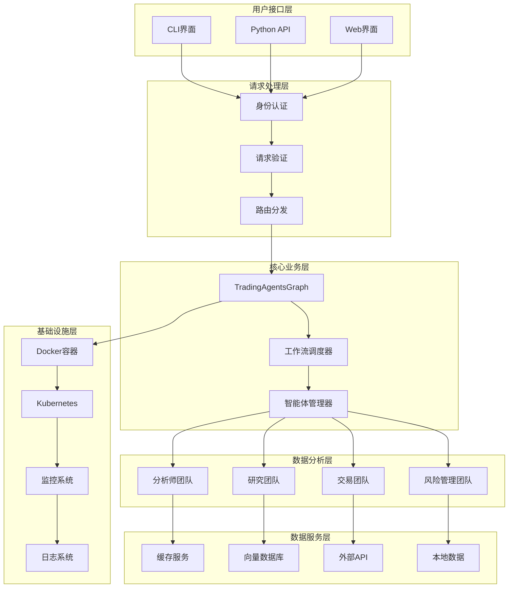

### 1.2 数据流程图

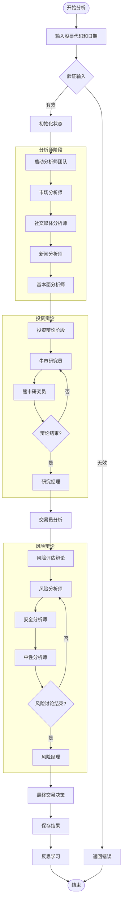

## 2. 智能体协作流程

### 2.1 分析师团队工作流程

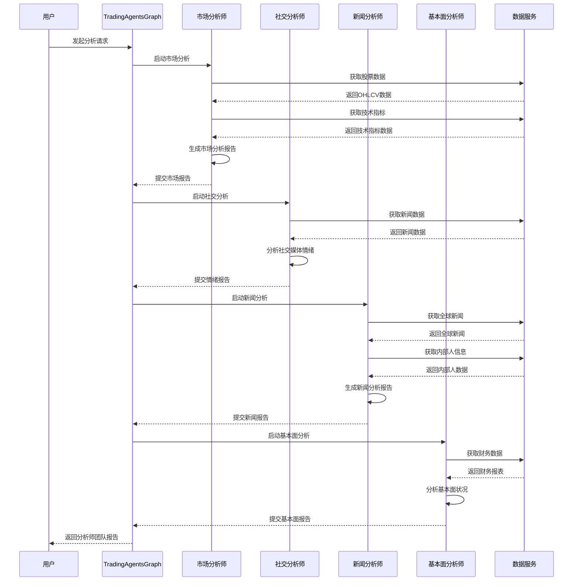

### 2.2 投资辩论流程

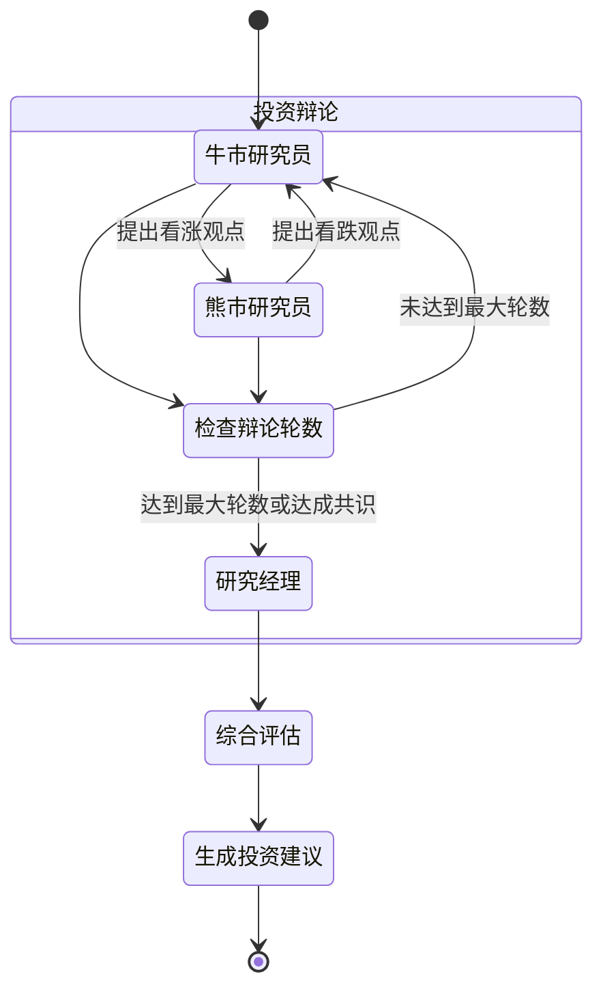

### 2.3 风险管理流程

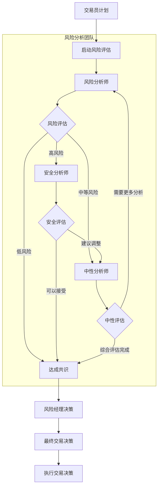

## 3. 数据处理流程

### 3.1 数据获取流程

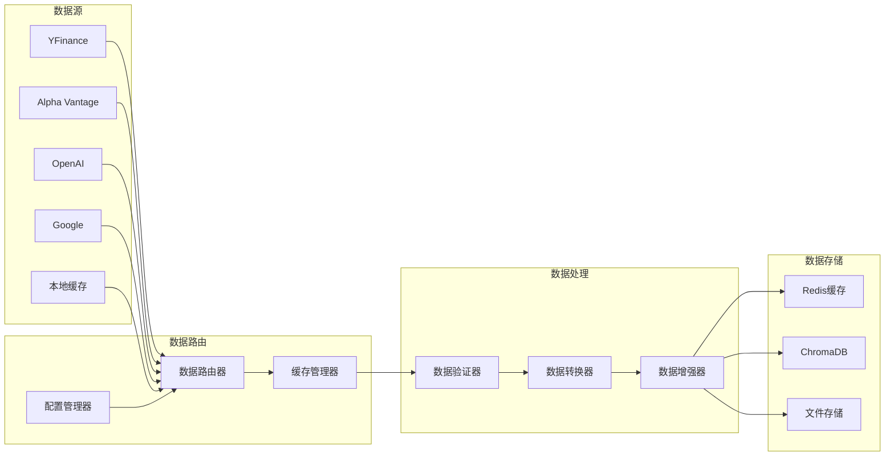

### 3.2 缓存策略流程

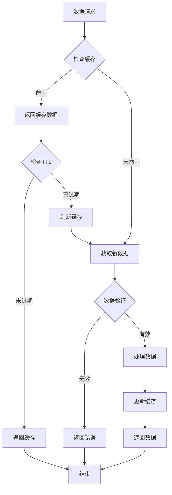

## 4. 机器学习流程

### 4.1 智能体决策流程

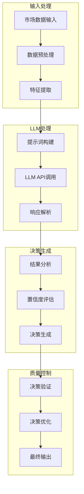

### 4.2 学习和反思流程

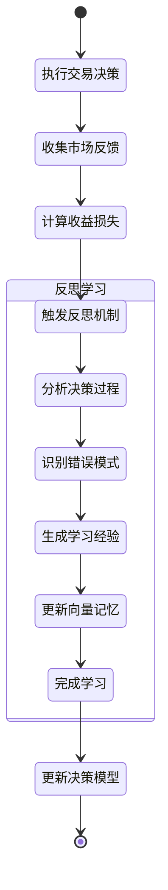

## 5. 系统运维流程

### 5.1 部署流程

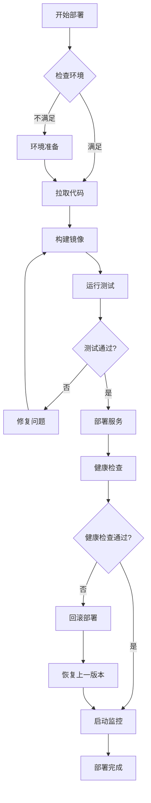

### 5.2 监控告警流程

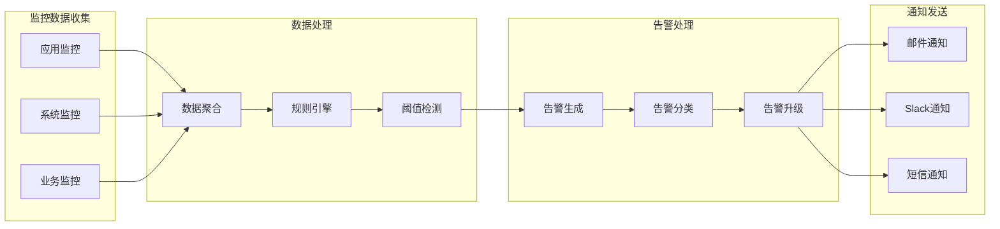

### 5.3 故障处理流程

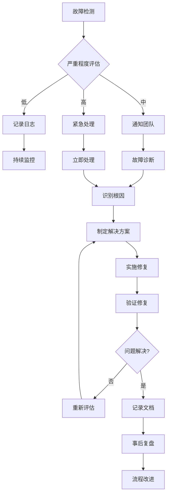

## 6. 安全流程

### 6.1 身份认证流程

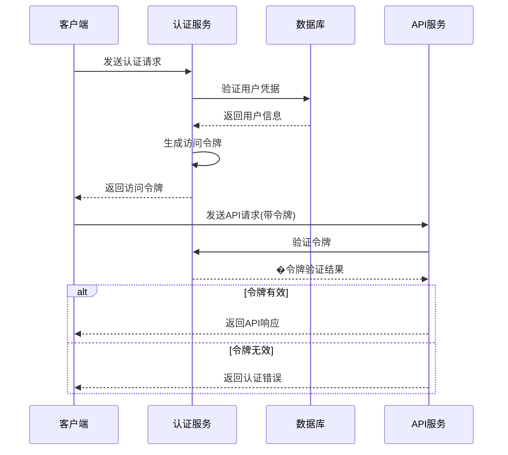

### 6.2 数据安全流程

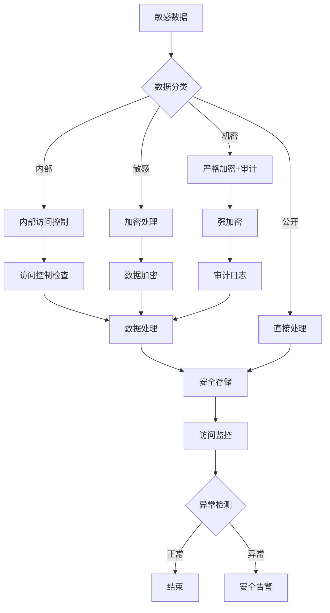

## 7. 性能优化流程

### 7.1 性能监控流程

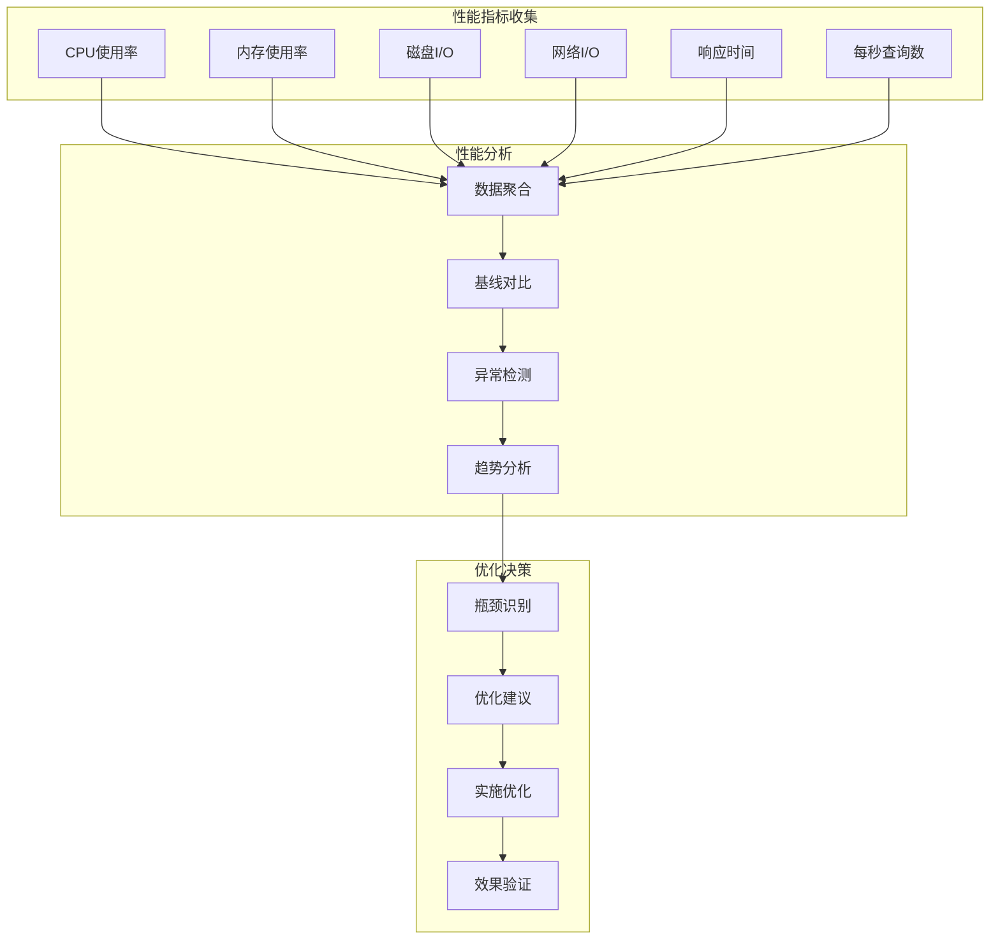

### 7.2 自动扩缩容流程

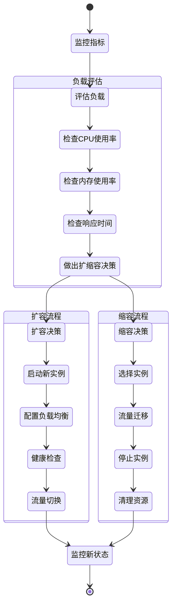

## 8. 数据治理流程

### 8.1 数据质量管理

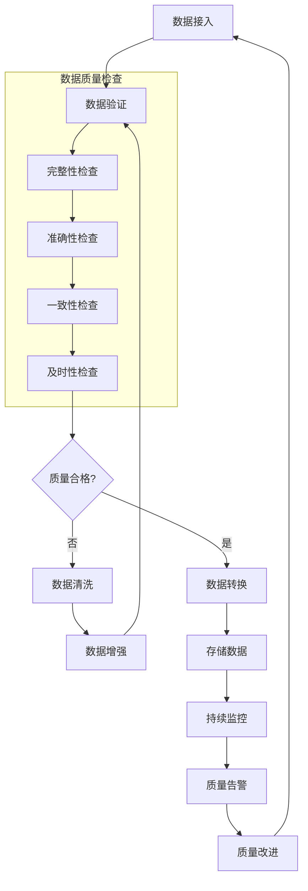

### 8.2 数据生命周期管理

```mermaid
graph LR
    subgraph "数据创建"
        CREATE[数据创建]
        CLASSIFY[数据分类]
        TAG[数据标记]
    end
    
    subgraph "数据使用"
        ACCESS[数据访问]
        PROCESS[数据处理]
        ANALYZE[数据分析]
    end
    
    subgraph "数据维护"
        BACKUP[数据备份]
        UPDATE[数据更新]
        MIGRATE[数据迁移]
    end
    
    subgraph "数据归档"
        ARCHIVE[数据归档]
        COMPRESS[数据压缩]
        STORAGE_OFFLINE[离线存储]
    end
    
    subgraph "数据销毁"
        RETENTION[保留策略]
        SECURE_DELETE[安全删除]
        AUDIT_DELETE[删除审计]
    end
    
    CREATE --> CLASSIFY
    CLASSIFY --> TAG
    TAG --> ACCESS
    
    ACCESS --> PROCESS
    PROCESS --> ANALYZE
    ANALYZE --> BACKUP
    
    BACKUP --> UPDATE
    UPDATE --> MIGRATE
    MIGRATE --> ARCHIVE
    
    ARCHIVE --> COMPRESS
    COMPRESS --> STORAGE_OFFLINE
    STORAGE_OFFLINE --> RETENTION
    
    RETENTION --> SECURE_DELETE
    SECURE_DELETE --> AUDIT_DELETE
```

这些流程设计图全面展示了TradingAgents系统的各个层面和环节，为系统设计、开发、部署和运维提供了清晰的指导。