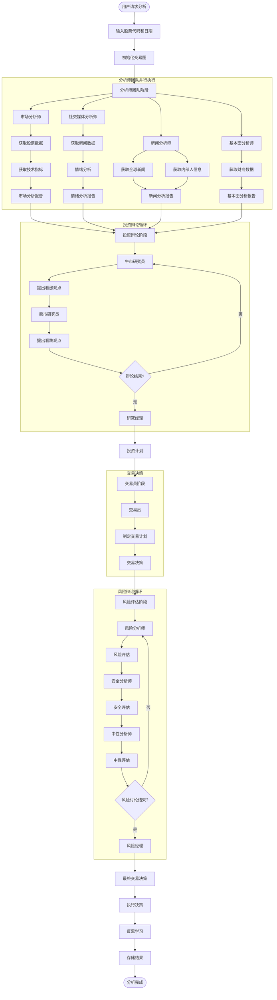

# TradingAgents 系统架构总览

```mermaid
graph TB
    subgraph "用户接口层 User Interface Layer"
        CLI[CLI命令行界面]
        API[Python API接口]
        WEB[Web界面可选]
    end
    
    subgraph "核心框架层 Core Framework Layer"
        TG[TradingAgentsGraph<br/>主控制器]
        GS[GraphSetup<br/>工作流设置]
        CL[ConditionalLogic<br/>条件逻辑]
        PROP[Propagator<br/>状态传播器]
        REF[Reflector<br/>反思器]
        SP[SignalProcessor<br/>信号处理器]
    end
    
    subgraph "智能体层 Agent Layer"
        subgraph "分析师团队 Analyst Team"
            MA[市场分析师<br/>Market Analyst]
            SA[社交媒体分析师<br/>Social Analyst]
            NA[新闻分析师<br/>News Analyst]
            FA[基本面分析师<br/>Fundamentals Analyst]
        end
        
        subgraph "研究团队 Research Team"
            BR[牛市研究员<br/>Bull Researcher]
            BER[熊市研究员<br/>Bear Researcher]
            RM[研究经理<br/>Research Manager]
        end
        
        subgraph "交易团队 Trading Team"
            TR[交易员<br/>Trader]
        end
        
        subgraph "风险管理团队 Risk Management Team"
            RA[风险分析师<br/>Risk Analyst]
            NA2[中性分析师<br/>Neutral Analyst]
            SA2[安全分析师<br/>Safe Analyst]
            RISK_MGR[风险经理<br/>Risk Manager]
        end
    end
    
    subgraph "数据流层 Data Flow Layer"
        subgraph "数据提供商 Data Providers"
            YF[YFinance<br/>股票和技术数据]
            AV[Alpha Vantage<br/>基本面和新闻数据]
            OAI[OpenAI<br/>新闻数据生成]
            GOO[Google News<br/>新闻数据]
            LOC[本地缓存<br/>Local Cache]
        end
        
        subgraph "数据接口 Data Interface"
            INT[Interface Router<br/>数据路由器]
            CONF[Config Manager<br/>配置管理器]
            CACHE_MGR[Cache Manager<br/>缓存管理器]
        end
    end
    
    subgraph "存储层 Storage Layer"
        subgraph "向量存储 Vector Storage"
            VM[ChromaDB<br/>向量数据库]
            MEM[Financial Memory<br/>金融记忆]
        end
        
        subgraph "文件存储 File Storage"
            LOG[日志文件<br/>Log Files]
            CACHE[数据缓存<br/>Data Cache]
            RESULTS[结果存储<br/>Results Storage]
        end
    end
    
    subgraph "基础设施层 Infrastructure Layer"
        DOCKER[Docker容器]
        K8S[Kubernetes编排]
        MONITOR[监控系统<br/>Prometheus/Grafana]
        LOG_SYS[日志系统<br/>ELK Stack]
    end
    
    %% 连接关系
    CLI --> TG
    API --> TG
    WEB --> TG
    
    TG --> GS
    GS --> CL
    TG --> PROP
    TG --> REF
    TG --> SP
    
    GS --> MA
    GS --> SA
    GS --> NA
    GS --> FA
    GS --> BR
    GS --> BER
    GS --> RM
    GS --> TR
    GS --> RA
    GS --> NA2
    GS --> SA2
    GS --> RISK_MGR
    
    MA --> INT
    SA --> INT
    NA --> INT
    FA --> INT
    BR --> VM
    BER --> VM
    TR --> VM
    RM --> VM
    RISK_MGR --> VM
    
    INT --> YF
    INT --> AV
    INT --> OAI
    INT --> GOO
    INT --> LOC
    
    CONF --> INT
    CACHE_MGR --> INT
    
    TG --> LOG
    INT --> CACHE
    PROP --> RESULTS
    
    DOCKER --> K8S
    K8S --> MONITOR
    MONITOR --> LOG_SYS
```

## 系统组件说明

### 🎯 用户接口层
- **CLI界面**: 交互式命令行界面，提供完整的功能体验
- **Python API**: 编程接口，支持集成到其他系统
- **Web界面**: 可选的Web界面（未来版本）

### 🧠 核心框架层
- **TradingAgentsGraph**: 系统主控制器，协调所有组件
- **GraphSetup**: LangGraph工作流设置和配置
- **ConditionalLogic**: 智能体间的条件逻辑控制
- **Propagator**: 状态在智能体间的传播
- **Reflector**: 反思和学习机制
- **SignalProcessor**: 交易信号处理和优化

### 🤖 智能体层
#### 分析师团队
- **市场分析师**: 技术分析、价格趋势、支撑阻力位
- **社交媒体分析师**: 情绪分析、社交数据、舆情监测
- **新闻分析师**: 新闻事件、宏观影响、行业动态
- **基本面分析师**: 财务健康、估值分析、成长性评估

#### 研究团队
- **牛市研究员**: 看涨观点、积极因素分析
- **熊市研究员**: 看跌观点、风险因素分析
- **研究经理**: 综合评估、投资建议、风险控制

#### 交易团队
- **交易员**: 交易计划制定、仓位管理、时机选择

#### 风险管理团队
- **风险分析师**: 风险识别、评估、量化分析
- **中性分析师**: 中立观点、平衡分析
- **安全分析师**: 保守策略、安全边际分析
- **风险经理**: 最终风险决策、投资组合管理

### 📊 数据流层
- **YFinance**: 免费股票价格和技术指标数据
- **Alpha Vantage**: 高质量基本面和新闻数据
- **OpenAI**: 基于LLM的新闻数据生成
- **Google News**: 广泛的新闻数据源
- **本地缓存**: 提高响应速度，减少API调用

### 💾 存储层
- **ChromaDB**: 向量数据库，存储智能体记忆
- **金融记忆**: 历史经验和学习结果存储
- **日志系统**: 完整的操作和决策日志
- **数据缓存**: 临时数据存储和加速
- **结果存储**: 分析结果和决策记录

### 🏗️ 基础设施层
- **Docker容器**: 应用容器化部署
- **Kubernetes**: 企业级容器编排
- **监控系统**: Prometheus + Grafana监控栈
- **日志系统**: ELK Stack日志收集和分析

## 数据流程图

## 技术架构特点

### 🔄 微服务架构
- **模块化设计**: 每个智能体都是独立的模块
- **松耦合**: 智能体间通过标准接口通信
- **可扩展**: 易于添加新的智能体和数据源

### 🧠 AI驱动
- **多智能体协作**: 模拟真实交易公司的团队协作
- **LLM集成**: 支持多种大语言模型
- **学习机制**: 反思和持续学习能力

### 📊 数据驱动
- **多源数据**: 整合多种数据源
- **实时处理**: 支持实时数据分析
- **智能缓存**: 多级缓存优化性能

### 🛡️ 企业级
- **高可用**: 容器化部署和自动扩缩容
- **安全可靠**: 完整的安全和监控体系
- **可观测**: 全链路监控和日志追踪

这个架构设计确保了TradingAgents系统能够提供专业、可靠、可扩展的金融交易决策支持。